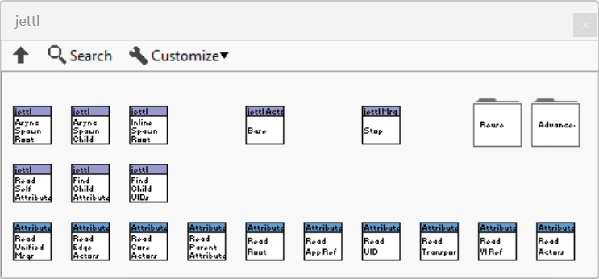

# jettl

[](https://www.vipm.io/package/nathan_davis_lib_jettl/)
[](https://www.vipm.io/package/nathan_davis_lib_jettl/)
[](https://discord.gg/tVkvTyBxqa)

A modern LabVIEW Actor Model implementation for building scalable applications.

*Dedicated to Stephen Loftus-Mercer, for his fantastic advancements in the LabVIEW development experience.*

*Inspiration from NI Actor Framework.*

> TODO: If you want this README to double as the “public contract,” fill in the following.
>
> - **Primary audience (LabVIEW role / domain)**:
> - **Supported LabVIEW versions**:
> - **Supported targets (Desktop / RT)**:
> - **Stability policy (SemVer? other?)**:

## Quick links

- **Documentation landing page:** [docs/jettl Documentation.md](docs/jettl%20Documentation.md)
- Start here: [Orientation](docs/Sections/Orientation.md)
- Reference:
  - [Glossary](docs/Sections/Glossary.md)
  - [Core Model](docs/Sections/Core%20Model.md)
  - [Runtime](docs/Sections/Runtime.md)
  - [API Reference](docs/Sections/API%20Reference.md)
- Developer workflow: [Tooling](docs/Sections/Tooling.md)
- How-to / patterns: [Usage](docs/Sections/Usage.md)
- Ideas and inspiration: [Non-Normative](docs/Sections/Non-Normative.md)

## What is jettl?

jettl is an interface-driven actor framework for LabVIEW. It is built around:

- **A strict actor tree**: every actor has `Self`, one `Parent`, and zero or more `Child` relations.
- **Statically-typed message telling**: messages are defined by interfaces; the destination (`Self`, `Parent`, or `Child`) is chosen explicitly by the caller.
- **Dynamic decoration**: a running actor is a *unified actor* composed of one or more *actor layers*.

If you are new to these terms, start with the [Glossary](docs/Sections/Glossary.md) and the [Orientation](docs/Sections/Orientation.md).

## Architecture at a glance

jettl systems are easiest to reason about in three layers of documentation:

1. **Orientation** — the mental model and reading path.  
   See: [Orientation](docs/Sections/Orientation.md)

2. **Core Model** — the normative contracts for actors, messages, lifetime, errors, and introspection.  
   See: [Core Model](docs/Sections/Core%20Model.md)

3. **Runtime** — behavior and constraints that depend on deployment (RT, PPLs, executables) and performance goals.  
   See: [Runtime](docs/Sections/Runtime.md)

## Installation

Install via VIPM:

- [Install on VIPM](https://www.vipm.io/package/nathan_davis_lib_jettl/)

After install, find the palettes under:

- `Data Communication -> jettl`



> TODO: Confirm the palette location and add a screenshot for the current release.
>
> - **Palette path (as it appears in LabVIEW)**: This is not necessary.
> - **Screenshot filename (under docs/Images/)**: This is not necessary.

## Example usage

This section is intentionally small and points to canonical examples in the docs.

> TODO: Point to the canonical “Hello World” example and keep it working in CI (or a manual checklist).
>
> - **Hello World example location (repo path or VIPM Example Finder name)**:
> - **What a new user should observe**:
> - **Screenshot filename (under docs/Images/)**:

Typical workflow (conceptual):

1. Create an actor library from a template.
2. Define messages as **interfaces** (one message method per interface).
3. Implement the message interface method in your actor layer.
4. From `Self`, `Parent`, or `Child`, **tell** the message using the strongly-typed tell VIs.
5. Use the lifetime contract (`Stop`/`Stopped`) to shut down cleanly.

For the practical, step-by-step recipes, see [Usage](docs/Sections/Usage.md).

## Documentation structure

The repository is organized so that the README stays concise and the full documentation lives under `docs/`.

```text
README.md
docs/
  ├── jettl Documentation.md
  ├── Images/
  └── Sections/
        ├── Orientation.md
        ├── Glossary.md
        ├── Core Model.md
        ├── Runtime.md
        ├── Tooling.md
        ├── Usage.md
        ├── API Reference.md
        └── Non-Normative.md
```

## Design philosophy

- Prefer **explicit contracts** over emergent coupling.
- Prefer **interface composition + decoration** over inheritance.
- Prefer designs that do **not** depend on message execution order.  
  (See: [Scheduling and Ordering](docs/Sections/Core%20Model.md#scheduling-and-ordering))

## Roadmap and open questions

> TODO: Convert these into GitHub Issues (or a tracking board) once you agree on wording.
>
> - **Roadmap owner**:
> - **Near-term milestone (next release)**:
> - **Medium-term milestone (next 3–6 months)**:
> - **Definition of done for a “stable” release**:

- [ ] **Static analysis**: define and enforce message contracts bidirectionally (Parent ↔ Child).  
  > TODO: Decide the minimum analyzer guarantees.
  >
  > - **What invalid states must be rejected at edit time**:
  > - **What is allowed to fail at runtime (if anything)**:

- [ ] **Documentation generation**: actor hierarchy + message destination diagrams.  
  > TODO: Choose the primary artifact(s).
  >
  > - **Diagram types (UML, sequence, custom)**:
  > - **Source of truth (static analysis vs runtime traces)**:
  > - **Where artifacts live (docs/Images vs generated folder)**:

- [ ] **Testing story**: unit tests, approval tests, and a generated test panel.  
  > TODO: Define the testing stack.
  >
  > - **Unit test framework(s)**:
  > - **What is tested on Desktop vs RT**:
  > - **Minimum coverage goals**:

## Contributions and community

- Discord: https://discord.gg/tVkvTyBxqa

> TODO: Add contribution rules and code-style expectations.
>
> - **How to propose changes (PR process)**:
> - **Coding conventions source (Tooling.md section link)**:
> - **Review checklist**:
