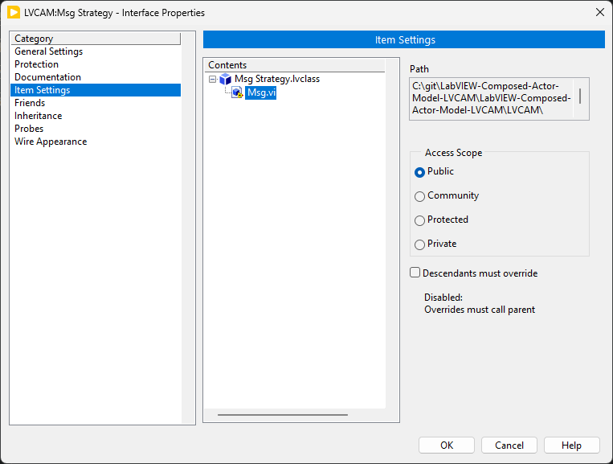
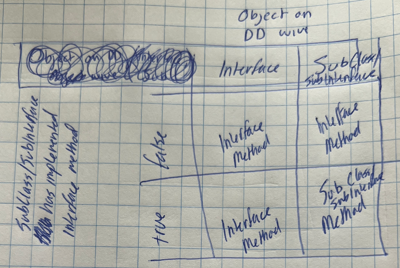
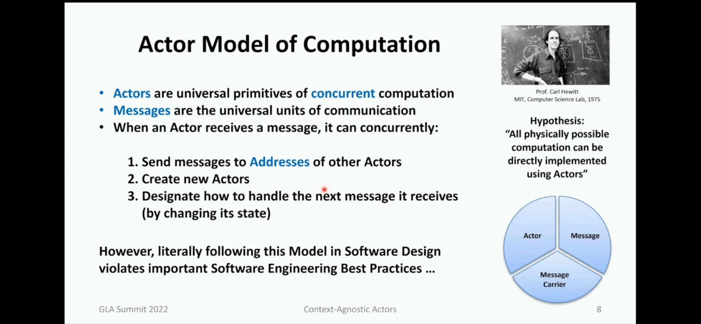

# Interfaces (General)

**Should one check `Descendants must override`?** 
By default, the checkbox is checked. If one unchecks it, it just means that when the interface method is executed (with a concrete implementation on the wire), if the concrete implementation does not implement the method (since the checkbox is not checked), then the interface method is executed. 
In this case, where the checkbox is not checked, the interface method is executed. By default, the method is abstract. Though, one can put implementation in here. This means that all concrete implementations that do not implement this method will execute this interface method.. This is beneficial when the default behavior between concrete objects must share the same behavior. 
This is not an excuse to use concrete implementations here. Still use interface methods and any additional behavior not tied to concrete implementations.
> Application: interfaces tied to messages have the checkbox unchecked as the messages are protected scope.

## LVCAM Interfaces

 
*Interfaces changed to NOT override in ALL of DD methods and set to `Shared Clone`.*

### Message methods in Interface

Message method implementation in the interface has default behavior because it is not checked as must override

# Procedure

- make recieve and the other one with inputs and **OUTPUT** object

- Change `MsgToNested` to have icon be two lines i.e. `MsgTo` and `Nested`. chnage for all, including decorators in Dev Actor. 
 
*but have on two lines, with decorator on third line.*

# Nathan Decisions

## Dynamic Dispatch (DD)

Everything is DD, declaring to the compiler that *objects* input are the same *objects* being output. If the DD method is not used in a Subclass/SubInterface, don’t implement the method.

## Creating method, default should be shared clone

## Abandoning Datatype IO Serialization

An indication that the data in the datatype will *potentially* be manipulated is when a datatype is being passed in and out through a method. Unless an datatype can be manipulated in an Interface/Subclass/Subinterface, then the datatype should not have an output.

If a method must be serialized, embrace the flat sequence structure / error case structure. DO NOT pass a datatype from the input to the output of the method for the *sole purpose* of serialization. Understand that other developers will not know your intent and will assume that the data in the datatype will *potentially* be manipulated.

### Error Serialization

The traditional error input is not allowed.

Do not serialize by using an error cluster input and output. This provides difficulty for readability since the developer does not know if the error is being manipulated by the method.

## Interface Method Determination

 
*Determination of either Interface Method or Subclass/Subinterface Method call given the object passed to the DD wire and if the Subclass/Subinterface has implemented the interface method.*

## Class and Interface Definition

Container capable of housing.. 
**Class:** ..data AND methods. (two check boxes don't matter since no inheritance allowed) 
**Interface:** ..methods. (Default: unchecked) (doesn't necessarily mean abstraction)

## Package Best Practices

Reuse code between libraries occurs **only** by relation (implementation/association/dependency/composition/aggregation) to interfaces.

## All Classes/Interfaces contained in library

## Icons

- Shows Interface / Class name.
- color of banner indicates if a library/interface/class container.
- Text of method name
- color of method name indicates access scope of method/control.

## Accessor Methods

Only contains either the unbundle or bundle operation.

Never use property node syntax with accessor methods. Use the accessor methods as they're more descriptive, adhering to the rules in this writing.

~~Private~~: Do not make sense since the data is already private to the class. 
~~Public~~: Encapsulation is of upmost importance. Other class objects should not have ability to read/write this data type. 
Proteted: If an interface already knows the concrete classes will contain that private data. 
~~Community~~: if methods need to be called in a concrete class, then make them DD, have them in an interface, and implement the interface in the friend class. Friends are hard to track. best practice, no community.

## Wrapper Methods

Wrapping interface method with unbundle and bundle operation. Green outline of banner and method shows, the only operation that occurs internally is the unbundle, interface method, bundle

## Community Scope

Friends can ONLY be with class/interfaces within the same library. Promotes decoupling between libraries. This can change.

## Private data

If private data is to be accessed within the class that owns the data, always use unbundle/bundle. Do not use accessors.

## Naming Convention

Captial letters. Spaces.

Since all Class and method names, controls, etc are identified by their file extension, all words start with a capital letter and words are separated with spaces. 

# LVCAM - LabVIEW Composed Actor Model

## Actor Model

 
*Actor, Message, Message Carrier. Interfaces and implementations for each of the pieces?*

##  Message Methods

Payload Methods -> Message Methods

## Message methods are protected

Only the actor can execute the method, or other classes/interfaces that implement this interface containing the protected method.

## Accessors in LVCAM

Since inheritance is not used, accessors **are not** used very often (aside from helper classes such as State Pattern). 
This is especially true with Actors. Actors are self contained and rarely will allow other classes to use its attributes.

## Mediator

Mediator pattern is dataflow friendly and DOES NOT cause memory leaks since a created Actor only occurs once at a time, through the mediator. And can only shut down if the mediator says that the Actor should shutdown. 
The mediator knows who has whose reference to send messages. This helps establish the observer pattern too. No deadlocks can occur since the mediator operates one by one. It is the all knowing for the program, only forwarding messages to references that the message is intended for. 
An actor ever only knows about the mediator. 

### Multiple application instances

Idea: have application mediator that is between all. 
Or there is always a double layer of mediators? Where the top layer facilitates what the lower mediator does.. and when there is another application instance (which has its two mediators), the top mediators of both communicate to each other. 
The top mediators know about each others references, so they can communicate with each other.

Idea: If two applications are talking with each other, there now exist two mediators. 
An idea for this: there is again a mediator that is *above?* these two mediators? Idk

### Potential Future for LVCAM

Kind of the same framework you currently have.. just that the messages interact with a mediator that then (since it has references to everything) sends the message to the necessary actor. Note the Self Actor still has references to its Caller, Self, and Nested.. it’s just that the mediator ALSO knows who has these references and easily sends the message to those who have the reference that the message is going to has. This provides well for the observer pattern i.e. publisher and subscriber. 
There are effectively two places references are saved: Mediator and Self Actor. The Mediator always has the references and shares the necessary duplicates of references that pertain to the Self Actor since these are references to identify the Actor and how the mediator should allow the actor to interact with other actors (though, remember, the Actor doesn't know other actors exist.. only that there is a mediator). 
Further, the mediator knows which methods are messages of the actor. This is known at compile time since messages are all through interfaces, allowing the mediator to know which messages the actor can execute by checking which interfaces the actor implements. This check happens in the mediator, not in the actor. This can be a set of strings relating to the method name?, so upon creation of an actor (by the mediator), the mediator holds the reference to the actor and a *set* of method names that are tied to messages.

Just thinking out loud: 
So there is a concrete component that basically handles the business logic of the system with other sub business logic components that are more specialized / reusable. This can be thought of as some top level actor.

Ideas: maybe there is some merit to change the naming to..
- ..Caller, Self, Subscribers?
- ..Self, Others?

