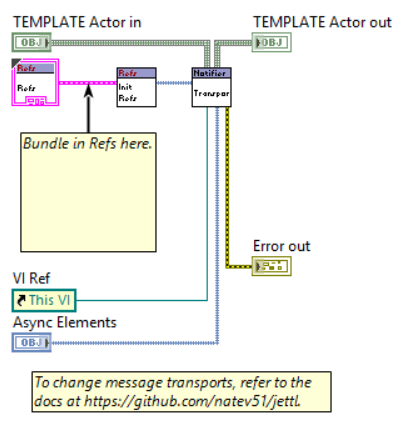

# Core Model

This document defines the core semantics of jettl: the actor model, the messaging model, and the lifetime/stop contract.

Sections marked **Guidelines**, **Ideas**, or **Notes** are non-normative.

## Terminology

### Definitions

- **Actor**: A single layer in the decoration stack (one class instance that implements the `Actor` interface).
- **Actor Layer**: Synonym for **Actor** when discussing layering explicitly.
- **Unified Actor**: The unified view of a running actor, formed by composing multiple actor layers.
- **Msgs**: The set of message methods implemented by a single actor layer.
- **Unified Msgs**: The union of messages implemented across all layers for the unified actor.
- **Turn**: One execution cycle of an actor.
- **Finalize**: A lifecycle hook invoked at the end of each actor execution turn.
- **Root**: The root unified actor of an application actor tree.
- **No Relation**: Two actors are “No Relation” when they do not have the same Root and do not have a parent - child relationship.
- **Core Actors**: A Root-scoped set of persistent actor layers that are composed into every child actor spawned under that Root.
- **Edge Actors**: A Root-scoped set of persistent actor layers that are composed into every child actor spawned under that Root, typically used for “outer boundary” concerns. These are for seen as advanced use cases and are to be avoided for beginners.
- **Base Actor**: The built-in, innermost actor layer provided by jettl. It is always present in every unified actor, unless the developer develops their own Base Actor, which would effectively change the internal logic of the jettl framework. The extension could be used for testing / debugging purposes.

## Actor Model

### Actor Transports

  
*Queue Actor.*

  
*Event Actor.*

  
*Notifier Actor.*

#### Guidelines

| Transport | Best For | Avoid When | Notes |
|---|---|---|---|
| Queue | Performance / throughput | IPC / event-structure-centric designs | Message throughput tends to be better; implementation is independent of UI-thread event handling. |
| Event | Front panel events and IPC | Maximum throughput is required | Use for event-structure-specific code, including dynamic event registration. |
| Notifier | “Last value wins” notifications | You need proven behavior at scale | Specialty transport; feature exists but is not tested as extensively as Queue/Event. Treat as specialized/experimental until covered by tests and benchmarks. |

> **TODO:** Add a short “when to use each transport” decision guide.
>
> - **Default transport recommendation**: Event.
> - **When to pick Queue**: Performance.
> - **When to pick Event**: Default, front panel events or other events that need to be dynamically registered
> - **When to pick Notifier**: specialized cases such as timing or notification like values independent of a FIFO.

Acceptance tests have not been performed or explored in the present writing.

### Persistence: Core Actors, Edge Actors, and Base Actor

#### Contracts

- `Core Actors` and `Edge Actors` are persistent layers for every actor in the application that are descendants of the same `Root`.
- For example, if the Root actor is spawned with `Debug jettl Actor` included in `Core Actors`, then that instance of `Debug jettl Actor` is used for each child actor spawned under that Root.
- `Base jettl Actor` MUST be the innermost layer of the unified actor, unless an advanced developer creates their own Base which effectively changes the internal logic that the Base otherwise has implemented in the decorator methods.

### Introspection and the Unified Actor

#### Concepts

The jettl API exposes public read-only accessors that can be used to read internals to the framework. Wrapped actors can use these read-only method chains to obtain the necessary information from the `Unified Actor` i.e. shared between actor layers that comprise the `Unfied Actor`.

> **TODO:** List the “blessed” introspection chains (by intent), and which ones are stable contracts vs internal conveniences.
> 
> **I do not know what blessed means, can you please be more specific?**
>
> Duplicate the row for additional chains.

| Intent                                                                                    | Example Call Chain                | Stability (Stable/Internal)                                                                                       | Notes |
| ----------------------------------------------------------------------------------------- | --------------------------------- | ----------------------------------------------------------------------------------------------------------------- | ----- |
| Find the VI Ref for a child actor to place that actors front panel into the parent actor. | Attributes.lvclass:Read VI Ref.vi | Stable, but internal implementation abstracted from the developer, but just an unbundle since a Read method call. |       |

### Private Actors

#### Contracts

- A library MAY contain multiple actors that are marked private to the containing actor such as in the `Private Actors` virtual folder.
- Only one actor SHOULD be the primary entry point for an actor library, hence the actors closely coupled to the public actor are private to that containing public actor.
- Supporting actors in the library SHOULD be Private to the containing actor library.

#### Guidelines

- Future tool MAY give ability to enforce “supporting actors are private” via a VI Analyzer test.

### Actor Layers

#### Concepts

Actors can decorate each other in layers.

- If a layer implements a Message, functionality will be extended in that layer.
- If a layer does not implement a Message, that Message is effectively a no-op at that layer.

`Msg or Recurse.vi` checks `Msgs` for that layer, and additional appended logic will determine whether the current layer implements the message method. If not implemented, it recurses to the next layer until the innermost layer is called which in most cases is the Base.

### Child UIDs

#### Contracts

- `Child UIDs.ctl` enum is a static developer-facing string used for keeping track of Child UIDs that are static in the system, not necessarily persistent for the application, but known at edit time.

#### Implementation Notes

- Internally, UIDs are stored as strings in `Child Attributes Map.ctl`.
- Each actor defines its own private enum for child UIDs.
	- A runtime string mapping MAY be validated to ensure it only maps enum elements to their corresponding string values via the `Format Into String` primitive.

#### Rationale

- Actor code uses enums exclusively, avoiding stringly-typed identifiers, which are common to mistype and do not propagate for other string constants of the same string.
- The internal string representation remains compatible with mapping needs.

#### Guidelines

- The enum is currently edited manually.
- A future tool MAY automate enum updates.

### Message Routing Inspection Overrides

#### Concepts

Overrides such as `Tell Self Inspect.vi`, `Tell Parent Inspect.vi`, and `Tell Child Inspect.vi` can enforce where Messages are allowed to go (e.g., **Self**, **Parent**, **Child**) based on static destination selection at edit time.

#### Contracts

- If a Message requires a relationship that is not satisfied, an error MUST be generated at runtime to prevent invalid message paths, if desired.
- A future static analyzer test SHOULD eliminate these runtime errors by catching invalid messaging paths earlier from tests. This would be done by programatically finding which message interfaces an actor implements and through child relationships, determines which bidirectional message would otherwise transport between the two actors. If these messages are not implemented in the respective actor, then the tool will convey this.

#### Implementation Notes

A defensive fallback can be implemented by decorating message handling in a case structure that safely handles “received but not implemented” messages by allowing an unexpected message through. This is done by use of a Core Actor (that is persistent for all actors that are descendants of the same Root) that has overrides for the necessary method calls to correctly parse message inputs for certain messages, before being executed with checks in the private data that would propagate to other override methods in the same turn.

## Messaging Model

### Messages and Interfaces

#### Contracts

- All Messages come from an interface. This is a scripted action.
- Messages follow the Interface Segregation Principle: one Message method belongs to one interface. This allows scripting tools to find message implementations for actors, giving rise to documentation generation, message validation upon telling messages preventing runtime errors, and testing.

#### Guidelines

- If naming conflicts appear for message naming, treat them as a signal that module boundaries and packaging need adjustment. This is encouraged to immediately refactor readily with the tools that are designed for this including the renaming and rescripting tools which take care of all the refactoring for you.

### Scheduling and Ordering

#### Guidelines

- Callers SHOULD assume they cannot control the order that messages execute.
- If ordering is required, serialize explicitly (e.g., a single message representing the sequence, a state machine, or an explicit serialization structure).

For priority semantics (if any), see [Scheduling and Priority](Runtime.md#scheduling-and-priority).

### Message Inputs, Outputs, and Type Definitions

#### Contracts

- Type definitions used as Message inputs SHOULD be located in the containing Message library, if possible. This prevents circular dependencies, centralizing the message with the type def.

#### Rationale

This supports dependency inversion and avoids circular dependencies.

### Polymorphic Selection and Implementation

  
*Polymorphic Message.*

  
*Message implementation.*

> **TODO:** If these images drift from the current implementation, update:
> 
> Why is this here? What do I need to do?
> 
> - `../Images/msg-poly-selection.png`:
> - `../Images/msg-implemented-recurse.png`:

### Private Messages

#### Concepts

Certain messages are intended to be private (self-messages) and not told by external actors. Place these messages in the `Private Msgs` virtual folder so that they are private to the containing actors library, hence not being able to be called external to the actor.

#### Contracts

- Private messages SHOULD be marked private to the containing actor library.
- Messages not exposed to external callers MUST be restricted via library access scope.

### No-Children Actors

#### Definitions

- **No-Children Actor**: An actor that cannot spawn children. It only messages with its parent and cannot have child messaging relationships. These are fundamental actors that should perform tasks in a reuse capacity, but not always.

#### Contracts

- If a Parent spawns a Child, the Parent SHOULD implement all interfaces required by the Child for Child → Parent messaging.
- A runtime check MAY prevent spawning if the Parent does not implement required Child → Parent messages. This could be a VI Analyzer test.
- If the Parent does not implement an interface, message methods are effectively no-ops, and default behavior MAY be handled in the Parent (`Call Inspect.vi`) or the Child (`Tell Parent Inspect.vi`).

#### Implementation Notes

- `Call Inspect.vi` SHOULD internally use `Read Listened To Msg.vi` to ensure the message being inspected was listened to and not normally called inline with the `Call.vi` for that particular message.

### Setup-Time Messaging

#### Contracts

- Messages MAY be told to Self and Parent (and any children spawned) in `Setup.vi` since actors can child actors can spawn in Setup as well as the parent attributes are already known in setup, so messages can be send to the parent as well as any spawned children. Therefore, children can be spawned, and if there is an error spawning the child, then the parent will consequently not spawn. This is a major feature since an entire actor hierarchy can be spawned without the root / parent fully spawning. This gives rise to more design patterns due to an implicit synchronization of spawning. Note spawning is the only synchronous relationship between two actors, after that the processes are fully asynchronous. Synchronous behavior is an advanced concept not natively handled by the framework as it is discouraged due to race conditions, etc.
- Actors MAY be spawned in `Setup.vi`.

### Unified Messages

#### Concepts

- Messages are decoupled between layers.
- Telling a message to an actor defined in only one actor layer but not in all other actor layers  still means the message appears in `Unified Msgs`. This basic cases is the `Stop` and `Stopped` messages are implemented in the Base Actor, but maybe not implemented in the other actor layers. Nonetheless, these two messages are in the `Unified Msgs`.

### Telling Unimplemented Messages

#### Concepts

A message can be told to an actor that has not implemented that message. This behavior can be modified in `Core Actors`.

### Unhandled Messages

#### Notes

A practical test for validating `Unhandled Msgs` behavior:

1. Add a `Panel Close?` event to an event actor.
2. Tell `Stop` to `Self` here.
3. Tell `Stop` to `Self` after the above `Stop`.
4. Verify the second `Stop` message is captured as an unhandled message (e.g., 1bd with an array of messages) to confirm one of the `Stop` message was not handled, since the actor received the stop already and is otherwise stopping and will not execute any more messages.

### Messages Producing Output Data

#### Concepts

Messages can output data.

#### Rationale

This enables wrapper layers to consume inner-layer outputs for things such as logging, auditing, metrics, or trace enrichment without re-computing or re-deriving the same data in other method calls. For example, an analysis is performed and used in an actor layer. If that analyzed data is also apart of the messages output, then that data, can be used in another actors layers implemented message method of the same type.

#### Ideas

- Consider an output (e.g., a log interface output) on terminal 1 that can be dependency injected with a developer-provided concrete implementation such as detected events for starting and stopping given a certain message outputs. 

### Strongly-Typed Message Destinations

#### Contracts

- jettl enforces a strongly typed messaging system where the message destination is known at edit time i.e. to the relative parent, self, or child (with more specific enum analyzed for granular destination).
- An edit-time analysis (e.g., via VI Analyzer or an actor-layer analyzer) SHOULD determine allowed spawn relationships by validating message contracts bidirectionally:
  - What the parent can **tell to** and **listen to** its child.
  - What the child can **tell to** and **listen to** its parent.
  This will leads to documentation generation.

#### Documentation Implications

Documentation tooling SHOULD be able to display which messages flow to and from `Self`, including:

- `Self → Self`
- `Parent → Self`
- `Child (with UID) → Self`
- `Parent <- Self`
- `Child (with UID) <- Self`

(`Self ← Self` is redundant and can be omitted.)

#### Scripting Constraints

- Only the two left input terminals are valid for scripting message inputs; other inputs are ignored.
	- If more than two inputs are required, define a typedef cluster in the message library.
- Only the two right output terminals are valid for scripting message outputs; other outputs are ignored.

## Lifetime Model

### Lifecycle Pairs

The lifetime is expressed as symmetric pairs:

- **Spawn** / **Stopped**
- **Setup** / **Teardown**
- **Start** / **Stop**

### Stop Contract

#### Contracts

- `Stop.vi`:
  - Starts as `False`.
  - Only be changed to `True` inside `Stop.vi`.
  - Cannot be changed back to `False`.

- `Should Stop.vi`:
  - Stops when `Stop` is `TRUE` **OR** an error occurs.
  - Outputs `Can Stop = TRUE` when stopping conditions are met.
  - An error from `Finalize.vi` MUST imply the actor should stop; `Stop.vi` will be called if not already called.

## Spawning Model

### Inline vs Async Spawning of Root

#### Concepts

Inline spawning exists to support resource setup in the Main actor. If references are created in Main and not closed, they are guaranteed to be alive for the application lifetime.

#### Notes

- Inline does not spawn an async actor.
- Inline can be used to obtain outputs (actor state and error information) after the call completes, enabling straightforward dataflow signaling that the root actor has stopped.
- Multiple inline spawns can exist in the same application i.e. multiple roots can occur in the same application.

### Spawning Children

All children are spawned asynchronously.

### Reference Lifetime and Ownership

#### Guidelines

- Prefer creating and destroying references in the same actor.
- If a reference is created in Actor A and used in Actor B, define ownership explicitly:
  - Actor A should be responsible for closing it.
  - Actor A should outlive Actor B.
- Prefer creating references in `Setup.vi` (not `Init.vi`) when the reference lifetime should match the actor lifetime. This is because Setup is the first method call that exists in the actors lifetime that allows extended functionality.

#### Rationale

If a parent actor creates a reference that a child actor uses, and the parent actor stops while the child continues to run, the reference can become invalid. An actor should manage it's own state. Treat reference ownership as part of the actor contract: the creator should typically be the owner and should close it, unless ownership is explicitly transferred.

Additional rationale (practical framing):

- This is why jettl actors create and own their own event references and release their own references within the framework: the actor lifetime is guaranteed for those references.
- Creating references in a parent before a child spawns is usually a bad practice: when the parent stops, references created in the parent (but still used by the child) will be released, leading to the child performing operations on an invalid reference.

> **TODO:** Capture explicit ownership patterns you want to bless (keep it small).
> 
> What do you mean by bless?
>
> - **Common ownership pattern 1**: An actor should manage it's own references and not use references owned by other actors.
> - **Common ownership pattern 2**:
> - **Common ownership pattern 3**:

## Error Model

### Error Catalog

#### Contracts

- All errors that can occur in jettl are documented in `jettl.lvlib:Error.lvlib`.

### Error Handling Principles

#### Contracts

- No error goes unrecognized.
- No error goes unnoticed in the framework; everything is reported (except for releasing references).

#### Concepts

- Unless a function/method has an error input, it is assumed to run unconditionally when called.
	View this resource on error handling: [How I Approach Errors and Multiple Error Collection in LabVIEW](https://www.youtube.com/watch?v=2Vjk3of5d1Q&list=LL&index=1)

### Serialization and Error Wires

#### Contracts

- Errors MUST NOT intentionally be used for serialization i.e. A datatype MUST NOT be passed from input to output solely for serialization. The most common type is the error wire.

#### Guidelines

- If a method must be serialized, prefer an explicit structure (commonly a flat sequence structure; sometimes a case structure).

### Where Errors Are Handled

#### Guidelines

- Errors SHOULD be handled by the method or layer that introduces the error, unless a different layer explicitly owns the recovery policy i.e. a decorating layer MAY handle errors from inner layers when that layer is explicitly responsible for policy (e.g., `Error Handling jettl Actor`), logging, or translation. A decorating layer SHOULD NOT silently swallow errors from inner layers unless that behavior is an explicit part of its contract.

#### Implementation Notes

A generalized error-handling Core Actor can override default behavior (e.g., clearing selected errors in `Finalize.vi`) while still exposing errors on the error wire for developer control.

### Wiring Readability

  
*Minimal bend wiring philosophy: prioritize readability. Keep the error wire pushed to the back. Avoid wires crossing over the object wire. Prefer explicit serialization structures over error-wire serialization (this is not shown in the image).*

## Attributes

> Please find a place where to put this:
> Rationale for the Teller and Attributes libraries

### Concepts

Actors allow `Self`, `Parent`, and `Child` relations to inspect unified actor state after start. This is useful for persistent actors, debugging, and comparing current state to an earlier snapshot after start / teardown when starting.

One example: if an actor is spawned with its front panel shown, the parent can determine whether the child panel should also be displayed as a subpanel.

### Contracts

- Most Attributes are be instantiated when the actor is spawned.
	The remaining Attributes are instantiated just before Setup and after Start / Teardown in Starting.
- Attribute access are read-only via method calls.

### Visibility and Timing

| Item                                   | Value                                                                                                                                                                                                                                                                                                                       |
| -------------------------------------- | --------------------------------------------------------------------------------------------------------------------------------------------------------------------------------------------------------------------------------------------------------------------------------------------------------------------------- |
| Who can read attributes                | `Self`, `Parent`, and `Child` relations that share the same Root. Actors with **No Relation** MUST NOT be able to read attributes.                                                                                                                                                                                          |
| When attributes become readable        | Most attributes are readable during `Setup.vi` and `Start.vi` / `Teardown` in Starting and `Actors` field instantiated in Attributes afterward, but before handling messages. The unified actor is updated after start completes; if `Setup.vi` throws an error, the actor state is still updated after teardown completes. |
| Mutability rules                       | Read-only method calls only.                                                                                                                                                                                                                                                                                                |
| Thread-safety / by-value rules         | Attribute data is by-value, except for reference-like fields (e.g., App Ref, VI Ref).                                                                                                                                                                                                                                       |
| Introspection chains considered stable | All attribute introspection chains are considered stable.                                                                                                                                                                                                                                                                   |

> **TODO:** If “when readable” needs to be precise per field, add a table:
> 
> I don't know what this means, can you please be more specific with an example?

| Attribute Field | First Valid Phase | Updated Phase | Notes |
| --------------- | ----------------- | ------------- | ----- |
|                 |                   |               |       |

### Rationale: Teller and Attributes Libraries

The Teller and Attributes libraries are implemented as libraries containing interfaces and classes rather than collections of typedef clusters.

- **Encapsulation and controlled initialization**  
  Classes encapsulate private data. Using `Init.vi`, the class private data is instantiated a single time, after which multiple **read-only** methods provide access. This enforces the intended lifecycle and prevents developers from directly modifying the underlying data.
- **Read-only access enforced with interfaces**  
  Interfaces define and enforce read-only access patterns through method contracts. Typedef clusters do not provide a comparable mechanism to restrict writes from being written to.
- **Accessor discoverability and maintainability**  
  Avoid clusters in favor of objects with explicit accessor methods (Anemic classes), since access points are easier to locate and reason about. These accessors are implemented as **method calls**, not property nodes.

## Reentrancy

### Constraints

- Preallocated reentrancy cannot be used for dynamic dispatch.

### Guidelines

A goal of jettl is to use only reentrant method calls to preserve true asynchronous behavior.

- For dynamic dispatch (DD) methods: use **Shared** clone reentrancy (preallocated is not available for DD).
- For non-DD methods: default to **Preallocated (inline)**. If that does not work, use one of:
  - **Preallocated (no inline)**
  - **Shared**

> **TODO:** Fill in concrete exceptions and the rationale.
>
> - **Non-reentrant calls allowed in jettl (if any)**: None.
> - **Methods forced to Shared (non-DD)**: Those found from description using `reentrancy` lookup.
> - **Methods forced to Preallocated (no inline)**: Those found from description using `reentrancy` lookup.
> - **Bookmark tag used for decisions**: `reentrancy`

## Feedback Questions

> Answer these to tighten the normative contract and reduce ambiguity.

- **What does “Turn” mean in each transport (Queue/Event/Notifier)?**: It means the same thing as the definition outlined.
- **Does jettl guarantee “at-most-once” delivery for a told message? If not, what are the failure modes?**: Yes, a told message is always delivered, not necessary handled though. This stems from this being an asynchronous messaging framework. The exception is the Notifier transport which has not been extensively tested.
- **What is the canonical definition of “unhandled message” (and when is it recorded)?**: Unhandled messages are not listened to. An actor finishes it's message handling before all messages have been listened to, hence they are unhandled and the developer can override functionality in `Teardown` to explicitly handle the unhandled messages.
- **Which introspection chains are guaranteed stable across releases?**: All. Can you be more specific?
- **Which behaviors are intentionally transport-specific vs transport-invariant?**: Look in the transport section for this.
- **What error policy is part of the framework contract vs intentionally left to Core Actors?**: This is found in the `Should Stop.vi` which has already been detailed.
- **Which attributes are guaranteed readable during `Setup.vi` vs only after `Start.vi`?**: Both are the same Attributes that can be readable, only the `Actors` has not been written to, this occurs after `Start`, or if `Setup` threw an error, then after `Teardown` in `Starting.vi`.
- **What is the minimum test suite required to validate “Core Model compliance”?**: I do not have a test suite, do you have recommendations of how I can do this?
