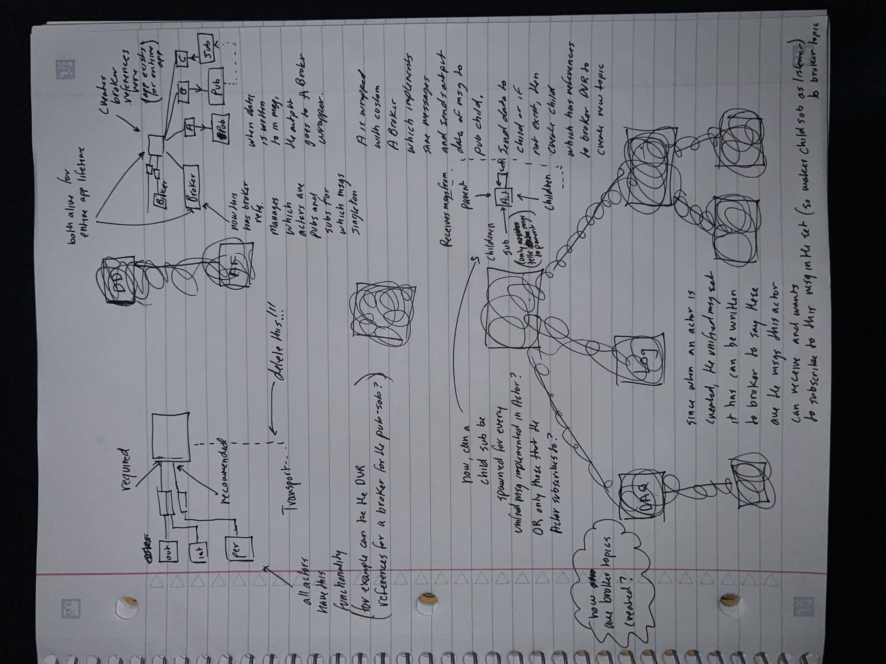

# Non-Normative

This page contains ideas, inspiration, and backlog material that is explicitly **not** part of the formal jettl contract.

If a concept becomes part of the formal contract, move it into the canonical document and replace it here with a short link.

## Ideas that could be implemented

### Channel wire message transport

Idea: implement a Channel Wire-based message transport.

> TODO: Specify the motivation and constraints.
>
> - **Why Channel Wires (performance/safety/tooling)**:
> - **Target platforms**:
> - **Compatibility constraints**:
> - **Acceptance tests**:

### Spawn Parent

Idea: `Spawn Parent.vi` (Root input) so an actor can spawn its parent.

Use case: instead of launching an application “from the top,” an intermediate connection actor can run first, then spawn the Root actor, then spawn remaining actors from there.

> TODO: Define whether Spawn Parent is a real requirement or an exploration.
>
> - **Primary use case**:
> - **How it interacts with typed message contracts**:
> - **What invariants must still hold (Root uniqueness, No Relation)**:

### Async Spawn Child message wrapper

Idea: add an `Async Spawn Child` message in the core library as a wrapper for `Async Spawn Child.vi`.

> TODO: Specify the exact wrapper behavior.
>
> - **Inputs**:
> - **Outputs**:
> - **Error behavior**:
> - **Where it lives (Core Model vs Tooling)**:

### Error serialization improvements

Idea: add a structured mechanism for “more outputs” without abusing error wires as serialization.

Related canonical rule: [Error Model → Serialization and Error Wires](Core%20Model.md#serialization-and-error-wires).

Notes:

- consider explicit serialization nodes / sequence structures
- explore typed “splitter” utilities for enforcing dataflow

> TODO: Clarify what problem you are solving (and for which audience).
>
> - **Current pain point**:
> - **Preferred pattern**:
> - **Where the pattern is documented**:

### Actor index helpers

Idea: add additional function calls for “actor index” style introspection:

- whether this is the outer actor
- whether it is an edge/core actor
- etc.

> TODO: Define what “actor index” means canonically and where it is exposed.
>
> - **Exact meanings**:
> - **Public API or internal?**:
> - **Tooling that consumes it**:

### Attributes metadata

Idea: add a second object adjacent to Attributes called “Attributes Metadata”.

> TODO: Define what metadata is required.
>
> - **Metadata fields**:
> - **Who reads it**:
> - **How it is populated**:

## Broker / mediator

This section captures an architecture exploration for mediator/broker-based systems.

Resources (external):

- https://bitbucket.org/composedsystems/mva-framework/src/master/
- https://bitbucket.org/composedsystems/stream/src/master/

Communicating between targets (scratch):

Idea summary:

- Wrap a Core Actor (via Root spawn) with a mediator process that holds DVRs and coordinates publisher/subscriber behavior via user events.
- Subscribing/registering to a topic may be a blocking call that spawns its own child actor with private broker connection state.
- The observer pattern is implemented via explicit subscription and explicit shutdown coordination.

Notes:

- “No Relation” messaging is a candidate mechanism for cross-tree communication (needs formal definition if adopted).

Mediator / assembler wrapper idea:

- A mediator-based design is dataflow-friendly and avoids memory leaks because actor creation is serialized and coordinated through the mediator.
- Actor spawning can be enforced by placing a non-reentrant VI inside the `Spawn` override, ensuring concurrent instantiation cannot occur.
- Actors may only shut down when explicitly instructed by the mediator.

> TODO: Decide whether this is in-scope for jettl (core) or belongs as a separate project.
>
> - **In-scope? (Yes/No)**:
> - **If separate, where it lives**:
> - **If in-scope, which part is canonical (Core Model vs Runtime vs Usage)**:
>
> TODO: If “No Relation” messaging becomes real, specify the rules.
>
> - **What is allowed across No Relation**:
> - **How identities are represented**:
> - **Security / safety constraints (if any)**:
> - **Acceptance tests**:

## Inspiration

Ideas inspired by Actor Framework tooling and ecosystem:

- Network endpoint actors
- Actor hierarchy inspector
- Panel actor
- Test panels / actor tester
- Unit testing with Caraya
- Events for UI actor indicators
- Documentation tooling (AntiDoc plugin)
- DETT plugins for UML and sequence diagramming
- Open AF payload tooling
- Bowzer-style browsing tools
- State pattern actor template
- Example projects and CTIs
- Message monitor (runtime message tells)
- Actor system designer (system-level diagram of spawn hierarchy)
- Message forwarding tooling

> TODO: Group these into “implemented”, “planned”, and “inspiration only”.
>
> - **Implemented**:
> - **Planned**:
> - **Inspiration only**:

## Presentations

Working titles / talk ideas:

- “So, you're on the jettl team”
- “Intro to jettl”

> TODO: If you want the docs to reference talks, list canonical links.
>
> - **Talk title**:
> - **Link**:
> - **What section of the docs it supports**:

Resources of inspiration:

- [Introduction to DQMH](https://www.youtube.com/@ShireyStudios1)
- [GLA Summit 2025: Introduction to Actor Framework by Casey May and Dan Hooks](https://www.youtube.com/watch?v=bTydOIjY84E)

## References

Reference lifetime rationale is defined canonically in:

- [Reference Lifetime and Ownership](Core%20Model.md#reference-lifetime-and-ownership)

## Immediate changes

*The following includes a list of changes to the framework that can be done immediately.*

> TODO: Convert each item into a tracked issue with an owner and acceptance tests.
>
> - **Owner**:
> - **Acceptance tests**:
> - **Target release**:

Ideas:

- Add editor-visible comments in developer-facing code to clarify what is safe to modify.
  - `Init Actor`: DO NOT MODIFY (example rule)
- Create a tool to generate project-level actor hierarchy diagrams.
- Strengthen analyzer rules for library scoping and message visibility.

## Resources

> TODO: Add a curated list of links (talks, repos, papers) that directly informed the design.
