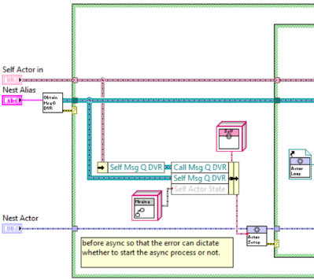

# Non-Normative

This page collects ideas, inspirations, and references that are explicitly **not** part of the normative jettl contract.

Use this material as a scratchpad and roadmap input. If a section becomes a real commitment, move it into a normative document (Core Model / Runtime / Tooling) and replace it here with a link.

## Ideas That Could Be Implemented


### Spawn Async Child jettl Msg

Add this to jettl library which effectively wraps `Async Spawn Child.vi`.

> **TODO:** Specify:
>
> - **What UX improvement the wrapper provides**: Instead of direct calling, can be told as a message, listened to as a msg, delay told as a message, etc.
> - **What it standardizes (defaults, logging, error handling)**: Not entirely sure what this standardizes.
> - **How it is tested**: No test is necessary, what do you think?

### Faster Lookup for Default Instantiations

This is a performance idea. Look ups for comparing default instantiations. Instead, use strings as they’re unique to the actor system. That way, you don’t have to instantiate objects, causing more overhead, and instead just pass out the string identifier. That means that the underlying “Msgs” and “Unified Msgs” are instead strings for faster lookup. That means adding a polymorphic with string output for the message name, used for quick lookup.

### Init Msg Performance Boost

The following has not been confirmed. Msg object passthrough may have better performance (test by creating subVI around instantiation and bundling to see which takes more time to do (VI Profiler), if it is the instantiation, then we change to pass the object around (same for output..) have to have output object as well.). instantiates the object once and passes as input datatype. This means to manipulate the object back in and write the data back in (override currently what is in the object private data). that dumb trick for arrays from the init reads to happen for the Msg Object as well! So the reordering of the front panel connections. Could just be explicit and have a map for input and output. Have the object manipulation be at the top of the message method for the interface.

### Inline the preallocated execution methods

Currently, all preallocated execution methods are not inlined. This should likely change for the future, but for now is used to benchmark where the most overhead is located using the `VI Profiler`. Most benchmarking tests must be conducted to optimize the framework for maximum throughput.
## Known Architectural Open Questions

These questions are intentionally tracked here until they are resolved and moved into a canonical owner page (Core Model / Runtime / API Reference).

> **JUSTIFICATION**: These questions previously existed as “out of band” notes. Recording them here makes the current uncertainty visible to readers and creates a clear backlog for tightening the contract.

1. Are Core Actors vs Edge Actors formally distinct or just conceptual?
2. Is “No Relation” messaging supported or only conceptual?
3. Is forwarding part of the framework or just a pattern?
4. What stability policy applies to APIs?
5. What minimum acceptance tests define Core Model compliance?
6. Is the Stop contract fully specified for all failure modes?
7. Should Channel Wire transport exist?
8. Is plugin architecture first-class or user-land?
9. Is Spawn Parent real or exploratory?
## Broker / Mediator

Resources:

- https://bitbucket.org/composedsystems/mva-framework/src/master/
- https://bitbucket.org/composedsystems/stream/src/master/

Communicating between targets, this is preliminary scratch work:

  
*This is preliminary scratch work for a broker pattern, breaking hierarchical communication.*

Also, for an inter-actor system (in separate instances/applications/targets), you can wrap around a Core Actor (for spawn root) the functionality of holding DVRs as some mediator process to allocate telling messages across the tree via user events.

This is a single-application-only method for publisher-subscriber, by using the decorated actor methodology.

##### Observer-style subscription

Just like spawning, the observer pattern used will have a blocking call when subscribing/registering for a topic by creating its own child actor, with the necessary private data internal to talk with the broker and its child actors.

This could be a `Core Actor`.

You can put a non-reentrant method call in `Setup.vi` for a given actor which can put setup information to a by-reference “thing” in the application.

Telling events across the tree via the `No Relation` type, maybe this should be a strategy pattern with classes to allow more options developers can create more concrete instantiations.

##### Mediator / Assembler

Note these ideas are slightly antipatterns, but are here nonetheless as ideas.

A mediator-based design is inherently dataflow-friendly and avoids memory leaks because actor spawning is serialized and coordinated through the mediator. Each actor instance is spawned at most once at a time under mediator control.

Actor spawning can be enforced by placing a non-reentrant VI inside the `Spawn` override, ensuring that concurrent instantiation cannot occur.

Actors may only shut down when explicitly instructed by the mediator. The mediator maintains authoritative knowledge of all actor references and determines which actors are permitted to tell messages to which recipients. This centralized reference management naturally supports observer-style interactions, including publisher–subscriber relationships.

Deadlocks cannot occur because the mediator processes interactions sequentially. While this introduces a potential bottleneck, that tradeoff is intrinsic to mediator or broker-based architectures and is often acceptable for the guarantees it provides.

The mediator functions as the system’s routing authority: it forwards messages only to actors holding valid references for the intended interaction. Individual actors are isolated from one another and are aware only of the mediator—not of other actors in the system.

Conceptually, this resembles the existing framework, with the key distinction that messages are routed through the mediator. Because the mediator holds references to all actors, it can forward messages to the appropriate recipients based on those references.

The actor itself still maintains references to its own `Self`, `Parent`, and `Children`; however, the mediator also tracks these relationships and governs how references may be used. The actor does not know other actors exist—it only interacts with the mediator.

This architecture supports the observer pattern cleanly. Actor references exist in exactly two places: the mediator and the actor itself. The mediator always retains the authoritative set of references and provides actors with only the references necessary for their permitted interactions.

Additionally, the mediator knows which messages an actor can handle through a unified messaging model. Because messages are defined via interfaces, the mediator can determine—at edit time—which messages an actor supports by inspecting the interfaces it implements. Message validation and routing decisions occur in the mediator, not in the actor.

At a higher level, this mediator can be viewed as a concrete component that encapsulates application-level business logic, coordinating a set of more specialized and reusable subcomponents. In practice, this mediator often corresponds to a top-level actor.

###### Multiple Application Instances

For multi-application scenarios, one approach is to introduce an application-level mediator that coordinates communication between individual application mediators. This suggests a layered mediator structure:

- Each application instance contains its own internal mediator.
- A higher-level mediator facilitates communication between application mediators.
- When multiple application instances are running, their top-level mediators exchange references and coordinate cross-application messaging.

If two applications need to communicate, each retains its own mediator. One possible extension is an additional mediator layer above both, responsible for managing inter-application interactions.

###### Assembler Role

An assembler may be used strictly to construct actors and distribute references required for observer-style relationships. Actors request construction and reference wiring through the assembler, rather than directly creating or discovering other actors.

> **JUSTIFICATION**: This section was moved from *Usage* because it is explicitly exploratory and not something the project is committing to as a recommended jettl pattern in the near term. Keeping it here preserves the ideas without teaching it as “the way.”

## Presentations

### “So, you're on the jettl team”

> **TODO:** Outline:
>
> - **Audience**: Those who will be working with jettl as their framework.
> - **Goal**: Overview best practices, key concepts, packages on VIPM, packages being developed, etc.
> - **Key sections**: Not sure yet, suggestions?
> - **Demo(s)**: Not sure yet, suggestions?

### “Intro to jettl”

Download on VIPM

Related channels (where updates and content typically appear):

- GitHub
- VIPM
- YouTube

> **TODO:** Add:
>
> - **A VIPM screenshot (most recent)**: Will do later.
> - **Install instructions (1–3 bullets)**: Suggestions?
> - **The first demo**: Suggestions?
> - **Common pitfalls**: Suggestions?

Resources of inspiration:

- [Introduction to DQMH](https://www.youtube.com/@ShireyStudios1)
- [GLA Summit 2025: Introduction to Actor Framework by Casey May and Dan Hooks](https://www.youtube.com/watch?v=bTydOIjY84E)
- [GDevCon ANZ #2 - Workers for LabVIEW: Building Modular, Scalable and Asynchronous Apps- Peter Scarfe](https://www.youtube.com/watch?v=wJg3K2tdSuQ)

> **TODO:** At the end of the presentation, include further topics and link to existing videos for each.
>
> - **Topic 1**: Not created yet.
> - **Topic 2**: Not created yet.
> - **Topic 3**: Not created yet.

## Immediate Changes

*The following includes a list of changes to the framework that can be done immediately.*  
*The order of items presented is in no particular order.*

---
---
---

Insert here.


---
---
---

## Resources

> **RESPONSE**: Please take the following TODO and integrate them into the documentation.

> **TODO:** Fill in curated links and repos.
>
> - **Official repo(s)**: https://github.com/natev51/jettl
> - **VIPM package**: https://www.vipm.io/package/nathan_davis_lib_jettl/
> - **Example repos**: https://github.com/natev51/jettl
> - **Recommended talks (top 5)**: None published so far.
> - **Recommended Packages**: I need to do this, currently none exist, but this will be very useful.

> **RESPONSE**: Please take the following Feedback Questions and integrate them into the documentation.
## Feedback Questions

- **Which “Ideas” are highest leverage in the next 1–2 months?**: Good question, I can prioritize them?
- **Which “Ideas” are intentionally long-term?**: I don’t know, can you help me prioritize them?
- **What should never become part of the normative contract?**: Suggestions?
- **Which ecosystem/tooling features are most important for adoption?**: All specified, though I moved these to a different section.


---
---
---
---


## `Stop` and **Coordinated Shutdown**

`Stop` is a standard lifecycle signal that initiates **Coordinated Shutdown**.

**Coordinated Shutdown Invariant**

> A parent actor MUST outlive all of its children.

This invariant is strictly enforced across the entire actor tree.

### State Transitions

When an actor receives `Stop`:

1. **If the actor has children**
   → Transition to `StoppingWithChildren`.

2. **If the actor has no children**
   → Transition directly to `StoppingWithoutChildren`.

---

### `StoppingWithChildren`

In this state:

* The actor instructs all direct children to stop.
* The actor continues processing messages (including application messages).
* The actor does *not* execute teardown yet.
* The actor waits until all children report `Stopped`.

Each child recursively applies the same logic:

1. Stop its own children first.
2. Execute teardown.
3. Notify parent with `Stopped`.

When the parent’s child set becomes empty:

→ Transition to `StoppingWithoutChildren`.

---

### `StoppingWithoutChildren`

In this state:

* The actor executes teardown.
* The actor notifies its parent that it has `Stopped`.
* The actor terminates.

---

### Contractual Rule

> All finalization logic MUST reside in teardown, never in `Stop`.

`Stop` initiates lifecycle transition.
Teardown performs cleanup.

---

## State Semantics Clarification

### `StoppingWithChildren`

An actor in this state:

* Has begun the stopping process.
* Has not executed teardown.
* Continues processing application messages.
* Is waiting for children to stop.
* Cannot spawn new children (assumed invariant — see questions below).

When children are exhausted:

→ Transition to `StoppingWithoutChildren`.

---

### `StoppingWithoutChildren`

* Teardown executes.
* Actor reports `Stopped`.
* Actor is stopped.

---

# Architectural Aside — Control Logic Smell

Consider:

```
Grandparent
  └── Parent
        └── Child
```

If:

* Parent receives `Stop`.
* Parent must wait for Child to stop.
* Parent teardown includes urgent safety logic (e.g., immediately setting pump speed to zero).

This indicates architectural misplacement of responsibility.

### Why This Is a Smell

Urgent control logic should not depend on waiting for subordinate actors to terminate. If teardown latency matters, the control logic is positioned too high in the hierarchy.

---

## Corrective Principle — Leaf Actors

A **Leaf Actor**:

* Cannot have children.
* Owns direct control of physical or critical processes.
* Executes teardown immediately upon entering `StoppingWithoutChildren`.

Critical, real-time responsibilities belong at leaf level.

---

## Structural Mechanism

Each actor contains:

```plaintext
Leaf : boolean (private data)
```

### Corrected Semantics

* `Leaf = true` → Actor CANNOT spawn children.
* `Leaf = false` → Actor MAY spawn children.

(Default must be explicitly defined.)

This flag is static and determined at edit-time.

### Unified Actor Rule

For composite or layered actors:

```
UnifiedLeaf = OR(all layer Leaf flags)
```

If any layer requires leaf behavior, the unified actor is treated as a Leaf Actor.

This ensures:

* Explicit architectural intent.
* Prevention of accidental hierarchy expansion.
* Guaranteed immediate teardown capability for lowest-level controllers.

---

# Critical Clarifications Required

Your answers resolved several design points, but there are still structural ambiguities that will matter in edge cases.

---

### 1. Message Processing During `StoppingWithChildren`

You stated that application messages are still processed.

**Clarification needed:**

* May new children be spawned in this state?
* If yes, Coordinated Shutdown can become non-terminating.
* If no, this must be an enforced invariant.

---

### 2. Idempotency of `Stop`

* If an actor already in `StoppingWithChildren` receives another `Stop`, is it ignored?
* Should `Stop` be idempotent?

---

### 3. Child Acknowledgment Contract

When a child reports `Stopped`:

* Is this guaranteed exactly once?
* What prevents duplicate or lost `Stopped` signals?
* Is this framework-enforced or developer-enforced?

---

### 4. Teardown Determinism

You stated full teardown always executes, even during termination.

* Is teardown required to be synchronous and blocking?
* Or may it be asynchronous and message-driven?
* If asynchronous, how is termination completion defined?

---

# Toward Formalization

You asked:

> How can I formally model the lifecycle as a deterministic state machine?

At minimum, you will need:

### Explicit States

* `Started`
* `StoppingWithChildren`
* `StoppingWithoutChildren`
* `Stopped`

### Explicit Guards

* `children.count > 0`
* `children.count == 0`
* `received Stop`
* `received Terminate`
* `received ChildStopped`

### Explicit Prohibitions

* No child spawning in stopping states.
* No state regression.
* No teardown execution before children complete.

Without these, formal verification is not possible.

---

# Follow-Up Questions

**Q1:** Should child spawning be strictly forbidden once an actor has entered any stopping state?
**Q2:** Should `Stop` and `Terminate` be modeled as distinct states, or as context flags within the same state machine?
**Q3:** Do you intend to eventually prove termination of the actor tree under all shutdown scenarios, or is this a pragmatic contract rather than a formally verified guarantee?

---
---
---
---
---
---

# jettl Tools

Tools -> jettl Tools ->

- Edittime
- Runtime

--

  

jettl Tools:  
replace TEMPLATE with Name  
  
—  
Template Tool:“Msg ID Generator.vi”: creates in the library description (other places too) a SHA1 (string) that is a parallel for loop that comprise a Msg ID. JSON Format:[“Msg ID”: “”]  
—  
Any naming Tool (“Rename” / “Poly VI Alias” generation) must have:- one, two, or three words- no more than two spaces- cannot start with space- cannot have two spaces in a row- All words start with capital letter (could be enforced under the hood while typing)- only alphabetical letters allowed- total character limit of 200  
Why: Easy for icon text display for Actors and Msgs  
“Excluded Names.vi”: checked programmatically for the library for the (either)- VI names already present

- Alias Names already present

—

Get rid of any enums for aliases.  
Use strings exclusively AND have them be checked in scripting tools as to not cause naming conflicts / duplication of Leaf Alias names

# Coordinated Shutdown

ONLY exists in the Root Actor.

—

Coordinated Shutdown guarantees that Root Actor always outlives Leaf Actors.

# Spawning

Only Root needs to address the Root Loop problem since Leaf Actors will always will be spawned after Root has been spawned.  
  
Root Async Actor.vi  
Make non reentrant, put highlight execution on. What is the recreated execution for:  
- Two Roots spawning one after another?  
What are the executions for these? Because we want to leak the first reference. And we want to know what to do, in the nonreentrant case without having the uninitialized shift register.  
  
---  
  
`Root Actor.lvclass`:  
- `Write Unified Root Actor.vi`  
- `Read Unified Root Actor.vi`  
  
`Leaf Actor.lvclass`:  
- `Write Unified Root Actor.vi`  
- `Read Unified Root Acto.vi`  
  
---  
  
Lifetime.  
All Actors are persistent for the application. Root is spawned and before finishing spawning, spawns all Leaf Actors. Leaf Actors will all be stopped and go out of scope before the Root is stopped.  
  
---  
  
In spawning, checks if the Alias Map has the same number of elements as the `Leaf Aliases` as defined through counting the number of Alias and associated Spawn VIs. This guarantees that each `Leaf Alias` has a Leaf Actor. All `Leaf Actors` are spawned at startup.  
  
---  
  
NOPE! This is statically determined at runtime that the Root Actor implements the Msg before Running. There is a check in Leaf Actor that only allows Msgs to be told to Root if Root Implements that Msg (different interface, but nonetheless same library).   
  
---  
  
- Always know what Base Root Actor and Base Leaf Actor messages are implemented.  
- Spawning Root Actor (with input of Core Actors), their messages can be saved as “Implemented Core Msgs”.  
UNFINISHED  
  
--  
  
Spawning:  
  
Root checks:  
- `Implemented Msgs` from Self  
- `Implemented Msgs` from Leaf  
  
Leaf checks:  
- `Implemented Msgs` from Self  
- `Implemented Msgs` from Root

# General Actor Concepts

Root should be HIGHLY functional, minimizing overhead of DD calls and other logic.  
  
—  
  
No recursion in Root Actor.  
  
—  
  
Root cannot use Tell Root (this one is the only one that instantiates classes)  
  
—  
  
Find Msgs can have a DD output?  
  
—  
  
in Actors,  
All preallocated calls MUST be inline. Why?:  
Maximum performance. Otherwise, if it can’t it’s probably a good idea to move the part that doesn’t allow inline execution into a Utility Library.

# General

Use of jettl:Some VIs in the jettl.lvlib are public since they’re used in the Actors. Some of these methods should not be used, though it is not clear which by inspecting the library. Therefore, we distinguish public function calls (no method calls) that can be used ans only those defined through polymorphic VIs, which are all found on the palette.  
—  
Get rid of jettl in names  
Keep Root Actor  
Keep Leaf Actor  
  
---  
  
Why even have a hierarchy of messaging? Why not have a broker that directly forwards Msg DVRs to other Leaf Actors directly. The answer is to  
- decouple the Leaf Actors from other Leaf Actors  
- Allow state logic in the Root Actor to execute messages differently as a middle man.

# Random

Since unconditionally calling Async Elements in “Setting Up.vi”:Put Decorator for Actor.vi IN Actor.viThen the enqueue of Async Elements occurs in “Base Actor.lvclass”.  
—  
Shit, can do the same for the Find Msgs? And output an array of the Msgs, then can index the array to properly get the correct Msgs for each Actor. Append functionality to decorator methods. Think about rewriting `Recurse.vi` as a decorator method. that unconditionally executes the `Recurse.vi` decorator every time.  
`Decorator.vi` -> `Init Actor.vi`  
  
—  
Avoid ANY UI Thread transfer:[https://www.youtube.com/watch?v=Zc8Xx9AFqtc](https://www.youtube.com/watch?v=Zc8Xx9AFqtc) @22:59  
  
Google: Set Control Values By Index. Use this instead of property nodes by mapping the control ref to the indexes at initialization.  
  
—  
But do take consideration to have pass through Object for Read methods TO avoid memory copieshttps://[youtu.be/Zc8Xx9AFqtc?si=Di0mG8iJLwI-5Eif@31:24OR](http://youtu.be/Zc8Xx9AFqtc?si=Di0mG8iJLwI-5Eif@31:24OR) Just co sided being diligent and use flat sequence structure to enforce serial execution. As suggested in video (by Eli Kerry, not error wire though!, flat sequence)Single frame flat sequence enforced ordering to avoid memory copies.—  
[https://www.youtube.com/watch?v=Zc8Xx9AFqtc](https://www.youtube.com/watch?v=Zc8Xx9AFqtc) @ 37:47Inline works for the Find Msgs VI with the inline setting since the block diagram is ABSORBED into the containing diagram, so the variant DOES work?  
—  
Greg NEVER changes the defaults for VI Properties  
[https://www.youtube.com/watch?v=Zc8Xx9AFqtc](https://www.youtube.com/watch?v=Zc8Xx9AFqtc) @ 45:38

# Msg DVR

jettl strives to be the gold standard in DVRs, memory, and performance optimization.  
Application lifetime guarantee of Root and Leafs.  
Leaf Defines in it’s private data (outermost layer for fastest lookup without DD calls to innermost layer) the:- “Msg DVR Root Buffer DVR”:”Array of Msg DVRs”- “Msg DVR Leaf Buffer DVR”:”Array of Msg DVRs”  
  
Why is the `Msg.ctl` a DVR i.e. `Msg DVR`?  
Answer:  
- To not create data copies in Root by transporting data from one DVR to another.  
- Since a `Msg DVR` in the Root Actor can be told to N many Leaf Actors, a new DVR must be used for each Leaf Actor that will listen to the Msg DVR. In the `Root Actor`:  
1. another Msg DVR is grabbed from the buffer and type def data is written to it.  
2. the `Msg DVR` is deleted  
  
The lifetime of the Msg DVRs lifetime are tied to the Leaf lifetime since the Leaf creates the DVRs.  
Now, the Buffers are tied to the Root Actor so that the Root Actor can easily map lookup the `Alias` to `Msg DVR Buffer` for a given Leaf Actor.  
  
For optimal performance, the Msg DVR is a type def cluster. Not a class, due to accessor overhead and class / interface and DD IO bugs.  
  
“Lifetime Root:Queue” created in Root Actor and when all Leaf Actors have told their Stopped Msg, then the Root Actor enqueues this and all Leaf Actors can then finish executing. Otherwise they continue executing messages.  
  
Therefore, the Msg DVR lifetime is just in the Leaf Actor that created it. DVR is deleted in Root and the Msg.ctl is gotten there using “Swap Values.vi”.  
Notice that Leaf can only Tell Self and Tell Root by pulling from the “Msg DVR Leaf Buffer DVR”.In Leaf, there is a check to ensure the Msg DVR is at at least the specified “Msg DVR Root Buffer Size:I32” of preallocated Msg DVRs (as defined by Root, but in private data of Base Leaf).  
By framework definition, all Leaf Actors are persistent and spawned at the beginning of the Root Spawn. Therefore, Leafs have the same lifetime as Root. For the complete lifetime, refer to documentation.   
  
Root does NOT create Msg DVRs.  
  
In the Leafs, a function is used to add Msg DVRs to the Buffers. Look into optimization by James Powell Memory in LabVIEW @build array section.  
Note to keep the Write to DVR time SMALL as to not lock resources from Root.Could be very smart and when filling the buffer back up creates New Msg DVRs (from parallel For Loop) and chucks a bunch into the “Msg DVR Root Buffers DVR”.   
—  
  
Msg DVR preallocation in Leafs:Preallocate Msg DVRs to memory in the Leafs.Use “Swap Values.vi” with IPES delete from array at first index, wire in 0. But this changes size of array.. so that’s out. So is there a way to slide the array to the left, pop the 0th element (valid Msg DVR) and add a default Msg DVR to end of array. Remember, the goal is for the array to remain the same size (for performance reasons, not allocating more memory for different size arrays)) when ready to use the Msg DVR.  
NOTE: That means in Root, in the “Name.vi”, when Tell Leaf, for a given Leaf can only accept one message, otherwise will pull from same index.  
WAIT: Can parallel Reads happen in parallel? What is the most memory/performance efficient?[https://forums.ni.com/t5/LabVIEW/DVR-Parallel-Read-Access/td-p/3645659](https://forums.ni.com/t5/LabVIEW/DVR-Parallel-Read-Access/td-p/3645659)  
Detail: always use the same SIZE array for Buffer, where the buffer chunk assigned (build array) never goes above array size defined, rest are always default Msg DVRs.Checks if (say) halfway point is a not a ref.[https://lavag.org/topic/15546-are-you-misusing-the-not-a-refnum-function-and-putting-your-app-at-risk/](https://lavag.org/topic/15546-are-you-misusing-the-not-a-refnum-function-and-putting-your-app-at-risk/)  
Can be a debugging entity that readily checks the size of the buffers i.e. in “Finalizing Turn.vi”.  
These Msg DVR Buffers ARE themselves DVRs that (by definition) only the Root and Leaf have access to.Let’s see.. this asks the question how large of a buffer size should be preallocated (can LabVIEW handle / bottle neck of absolute message transport speed of Root) to each of the Leaf Buffers?  
James Powell Memory in LabVIEW:Build array memory optimized @ 1/4 timestamp.  
Maybe there’s a dedicated “Priority” message (under the hood) that tells Leaf to allocate more memory to Msg DVR Buffer.  
  
—  
Documentation:In Root Actor, since the Tell Leaf function calls are statically typed in the “Name.vi” in Root Actor, this directly determines WHERE messages are told from and to to fill out the entirety of the tree hierarchy of mesaaging  
  
---  
  
  
DVR.. maybe don’t use read only parallel access, and only use the read/write with data wired through.  
[https://forums.ni.com/t5/LabVIEW/DVR-Parallel-Read-Access/td-p/3645659](https://forums.ni.com/t5/LabVIEW/DVR-Parallel-Read-Access/td-p/3645659)  
  
---  
  
Since Msg DVR is a type def cluster, the Mark As Modifier (on the IPES input) is not used since the data in the DVR is not directly a dynamic dispatch interface/class. Though, this could be reconsidered to use Mark As Modifier since there are interfaces within the `Msg.ctl` type def cluster.  
Note these resources on DVRs:  
- [https://lavag.org/topic/7761-in-place-element-structure-mark-as-modifier/](https://lavag.org/topic/7761-in-place-element-structure-mark-as-modifier/)  
- [https://lavag.org/topic/19685-dvr-and-error-handling/](https://lavag.org/topic/19685-dvr-and-error-handling/)  
- [https://forums.ni.com/t5/LabVIEW/Mark-as-modifier-in-place-of-structure/td-p/2028072](https://forums.ni.com/t5/LabVIEW/Mark-as-modifier-in-place-of-structure/td-p/2028072)  
- [https://www.ni.com/docs/en-US/bundle/labview-api-ref/page/structures/in-place-element-structure.html#:~:text=You%20can%20right%2Dclick%20a,data%20and%20avoid%20race%20conditions](https://www.ni.com/docs/en-US/bundle/labview-api-ref/page/structures/in-place-element-structure.html#:~:text=You%20can%20right%2Dclick%20a,data%20and%20avoid%20race%20conditions)  
- [https://forums.ni.com/t5/LabVIEW/Manipulating-DVR-Data-Is-this-correct/m-p/3211893](https://forums.ni.com/t5/LabVIEW/Manipulating-DVR-Data-Is-this-correct/m-p/3211893)  
- [https://forums.ni.com/t5/LabVIEW/quot-Data-Value-Reference-quot-and-quot-In-Place-Element/td-p/1558466](https://forums.ni.com/t5/LabVIEW/quot-Data-Value-Reference-quot-and-quot-In-Place-Element/td-p/1558466)  
- [https://www.ni.com/docs/en-US/bundle/labview/page/caveats-and-recommendations-for-using-in-place-element-structures.html](https://www.ni.com/docs/en-US/bundle/labview/page/caveats-and-recommendations-for-using-in-place-element-structures.html)  
- [https://www.ni.com/docs/en-US/bundle/labview/page/storing-data-and-reducing-data-copies-with-data-value-references.html#:~:text=Storing%20Data%20and%20Reducing%20Data%20Copies%20with,value%20references%20to%20store%20large%20data%20sets](https://www.ni.com/docs/en-US/bundle/labview/page/storing-data-and-reducing-data-copies-with-data-value-references.html#:~:text=Storing%20Data%20and%20Reducing%20Data%20Copies%20with,value%20references%20to%20store%20large%20data%20sets).  
- [https://medium.com/@thomas.zilliox/sharing-memory-between-modules-and-loops-in-labview-287e14e4039e](https://medium.com/@thomas.zilliox/sharing-memory-between-modules-and-loops-in-labview-287e14e4039e)  
- [https://www.youtube.com/watch?v=VIWzjnkqz1Q](https://www.youtube.com/watch?v=VIWzjnkqz1Q)  
- [https://www.youtube.com/watch?v=lPwLTCtgYDo](https://www.youtube.com/watch?v=lPwLTCtgYDo)  
- [https://forums.ni.com/t5/LabVIEW/Anyone-else-having-DVR-In-place-element-structure-bug-error-1556/td-p/4320674](https://forums.ni.com/t5/LabVIEW/Anyone-else-having-DVR-In-place-element-structure-bug-error-1556/td-p/4320674)  
- [https://forums.ni.com/t5/LabVIEW/Pointers-in-Labview/m-p/1242534#M525059](https://forums.ni.com/t5/LabVIEW/Pointers-in-Labview/m-p/1242534#M525059)  
- [https://forums.ni.com/t5/LabVIEW/Reference-to-a-variable/m-p/4038233#M1158672](https://forums.ni.com/t5/LabVIEW/Reference-to-a-variable/m-p/4038233#M1158672)  
- [https://www.ni.com/docs/en-US/bundle/labview-api-ref/page/functions/data-value-reference-read-write-element.html?srsltid=AfmBOoonDb0eZCRmaWPO4N9VNUrYt9_UCMS-Xoeok8eylPlcB3ber5dI](https://www.ni.com/docs/en-US/bundle/labview-api-ref/page/functions/data-value-reference-read-write-element.html?srsltid=AfmBOoonDb0eZCRmaWPO4N9VNUrYt9_UCMS-Xoeok8eylPlcB3ber5dI)  
- [https://www.youtube.com/watch?v=DTbqR0H-e8g](https://www.youtube.com/watch?v=DTbqR0H-e8g)  
- [https://lavag.org/topic/10983-dvr-vs-pointer/](https://lavag.org/topic/10983-dvr-vs-pointer/)  
- [https://www.ni.com/docs/en-US/bundle/labview/page/storing-data-and-reducing-data-copies-with-data-value-references.html?srsltid=AfmBOop8BAUarAnSy6KhSo8oJHJ-6_S7GbU5qGuWa3Pkd82RajZvUnJi](https://www.ni.com/docs/en-US/bundle/labview/page/storing-data-and-reducing-data-copies-with-data-value-references.html?srsltid=AfmBOop8BAUarAnSy6KhSo8oJHJ-6_S7GbU5qGuWa3Pkd82RajZvUnJi)  
and many other discussions on DVRs in LabVIEW.

# Working 1

TEMPLATE Root Msg.lvclass (interface)  
- “TEMPLATE.vi”  
  
TEMPLATE Leaf Msg.lvclass (interface)  
- “TEMPLATE Before.vi  
- “TEMPLATE After.vi  
  
Interfaces in jett:  
- “Execute.vi”  
  
—  
  
Goals of Root Actor:  
- Minimize runtime checks  
- Minimize runtime errors  
  
—  
  
In Spawn, check for:  
- Root Actor must have implemented all messages Leaf will tell.  
- Leaf Actor must have implemented all messages Root will tell.  
  
—  
  
Decouple the framework from external libraries.  
That means do not use poly function calls outside of actors.  
This ensures strictly typing the messages that are tied to the actor of interest.  
The tools only recurse through the actor of interest method and function calls to determine which “Tell Root.vi” calls will be made.  
  
—  
  
I really want to force developers to compile their code to PPLs. This will dramatically help build times and really show that this framework is high performance driven.  
Now.. could be difficultly with bitness, OS, and target.. but this should be looked at later. The mentality for fast build times is still there.  
  
—  
  
LabVIEW gripe  
Private access scope on methods cannot be dynamic dispatch. WHY? It’s not so much that I want to use these DD terminals for overriding, but rather to declare to the compiler that the object input will be the same at the object output.  
Maybe this isn’t all that bad since we can use preallocate reentrancy and inline the method call.  
Private preallocated SD method call. (Note it is not DD even though would be used not for overriding, but to declare to the compiler that the object in is the SAME object out, this will minimize memory copies and lead to better performance.) but preallocated private inline is always better performance! So better not to DD.  
Maybe there is a way to do this by internally (to the SD method) use the preserve runtime class OR outside of the method use the preserve runtime class.  
Maybe this can be done with the scripting tools to put in these preserve runtime class, but maybe it’s not necessary since they’re inlined anyway? And the compiler already KNOWS the method call passes the object through, since otherwise placing it into a DD method would break the DD method. HUH! TRUE!  
  
—  
  
Spawning check:  
Root Actor MUST have at least one Leaf Actor.  
Leaf Actor MUST have Root Actor be valid refnum..  
  
  
—  
  
Lifetime:  
Root Actor listens to Stopped as it’s final message. Leaf Actor lifetime: Only when the Root Actor listens to Stopped will the Leaf Actor be able to go out of scope (from a queue that is dequeued after the Tell Root Stopped Msg in “Tearing Down.vi”. This is because the Actor may otherwise need to forward and execute messages that are still coming from the Root to achieve Coordinated Shutdown.  
  
“Stopped Listened To:BoolQueue” AFTER Stopped as Dequeue (In Stopped reads “Stopped Listened To” and enqueues TRUE.  
Add “Stopped Listened To:boolQueue” to “Leaf Unified Actor.ctl” and is created and bundled at the “Update Unified Actor.vi” in “Setting Up.vi” for Leaf Actor.

# Working 2

Root Actor job:  
Listens to `Msg DVRs`, only uses Poly `Tell Leaf.vi` in Name.vi.  
  
—  
  
Root Actor has scripted `Name.vi`(Alias) Poly VI (within library to encapsulate name spacing for the following two private functions):  
- `Tell Leaf.vi` wraps `Tell Leaf.vi` with the destination Leaf correlating to the string that it is in (Poly VI Name).  
- `Spawn Leaf.vi` wraps `Spawn Leaf.vi` with the Leaf Actor correlating to the string that it is in (Poly VI Name).  
  
---  
  
The `Teller.ctl` is only updated in `Leaf Actors` in the `Tell Root.vi`.  
  
---  
  
Clusters implemented as DVRs:  
- `Msg.ctl`  
- `Msg DVR Buffer.ctl`  
  
Base Root Actor:  
`Msg DVR Buffer DVR Map`  
`Leaf Unified Actor Alias` to `Msg DVR Buffer DVR`  
  
---  
  
jettl is used ONLY as a PPL. If the developer is curious about the underlying functionality, then they should (as any other language) go to the git repository and examine the source code for further learning. Further, the documentation is the source of truth for the framework for both decisions behind the design of the source code along with usability of the jettl framework.  
  
---  
  
GOTCHA! Access Scope on Interfaces / Classes:  
Even though their libraries are private, the interface can still be implemented in other interfaces / classes **Rule: even if an interface is private to a library AND (to be more strict) the interface is marked private, other classes outside the library can still implement the interface.** While interfaces themselves can be set to private access scope within a project library, this primarily restricts which other VIs can _use_ or _call_ the interface, not which classes can _implement_ it. The same can be said for classes.  
Now, where this is a GOTCHA! If your interface is marked private to a containing library and that library is built into a PPL, NOW if you were to use that PPL, classes that otherwise could implement the interface (non-PPL), cannot implement the interface (PPL) SINCE the interface is private to the PPL and is not available in the PPL since it was marked as private!  
SO. Best practice for code development (non-PPL) to side step this rule above in LabVIEW (IMO the private scope on an interface / class or library containing (say) a public interface / class should be more restrictive and not let other interfaces/classes implement the interface/class if the interface/class is private to interfaces/classes outside of the containing library) is to not implement an interface (or inherit from a class) that is private to a containing library or public but containing library is private that that class/interface is not apart of.  
  
---  
  
Constraint: a mesaage can only be told, it cannot be directly called.  
  
—  
  
  
Msg DVR  
DVRs for messages, memory copies being created when telling user events. He addressed this in the example with a DVR as the payload.  
[https://youtu.be/zR6qe2POhFk?si=QVWJH4omuairiQLv](https://youtu.be/zR6qe2POhFk?si=QVWJH4omuairiQLv) @18:57

# Working 3

For Root Actor:  
`Release Transport.vi` location isn’t important since Leafs will be Stopped (Despawned State!!) when Root Actor shouldn’t handle anymore messages! ie when “Stopping Without Leaf Actors”.  
  
For Leaf Actors:  
Same, but location RIGHT when stop hits.  
  
REVIST THE ABOVE.  
  
—  
  
`Unhandled Msg DVRs`, make sure to delete the DVR.  
  
—  
  
Good idea to include field in Teller where the Msg DVR is type casted to I32 for the unique identifier.  
  
--  
  
Telling messages: a purely static design.  
  
Root Actor outbound messages:  
- `Root Tell Leaf.vi`  
- `Root Tell Self.vi`  
  
Leaf Actor outbound messages:  
- `Leaf Tell Self.vi`  
- `Leaf Tell Root.vi`  
  
—  
  
  
Spawn:  
Leaf Actor, hence Root Actors cannot be spawned unless Root Actor Implemented all Msgs Leaf tells Root Actor.  
  
—  
  
DVR:  
Messaging is purely hierarchical AND FAST due to DVRs. Minimizes overhead in Root when listening to messages and forwarding.  
Msg DVR should have knowledge of Root and Leaf?  
  
—  
  
Root Actor is a state machine with enum representing the state. This comes with the Root Actor with a default state of Idle. Benefits of enum approach as compared with State Pattern:  
- Direct manipulation of Root Actor state  
- No instantiating objects and calling their state through DD overrides, leading to DD overhead. Enums are statically typed.  
- State Pattern must have memory copies of Root Actor state when DD into the states DD object states.  
  
—  
  
ALREADY STATED:  
Spawning a Leaf Actor, checks if the Leaf Actor can:  
- listen to all messages available from Root Actor (Poly VI for Leaf string and message name)  
  
  
—  
  
jettl Goal:  
- Very static system.  
- Heavily typed system where everything is known at edit time. This minimizes dynamics, therefore preventing bugs and errors from occurring at runtime.  
  
The only “dynamic” part of the system is the decorations of Root Actor and Leaf Actors.  
  
Testing Leaf Actor and the Unified Leaf Actor FROM the statically typed SD method for spawning the Unified Leaf Actor.  
  
No dynamics, therefore no;  
- Factory Pattern  
  
—  
  
jettl has two actor types:  
- Root  
- Leaf  
  
—  
  
Take away the Private Actors virtual private folder  
  
—  
  
Constraint: One Root Actor and N many Leaf Actors.

# Working 4

Root Actor:  
N many decorators (note more decorations means more DD overhead).  
Root Base Actor is always innermost.  
(Define the Leaf Actors Core Actors here).  
  
Leaf Actors:  
Actors  
Core Actors (defined in Root Actor).  
(Get rid of Edge Actors)  
  
—  
  
Root Actor Transport:  
Queue. Queue used instead of Event for maximum performance as it is a 1:1 transport.  
MINIMUM LOGIC for maximum throughput of messages.  
  
Leaf Actor Transport:  
Event. Event used due to ability to 1:N message external entities in an application and control events.  
  
—  
  
Root Actor Spawning:  
Note spawning is blocking so spawning in the lifetime of Root is NOT allowed. This must occur upon initialization. Errors from a Leaf to the Root Actor is an automatic shutdown. HANDLE ERRORS IN LEAF otherwise automatic shutdown.  
  
—  
  
Create libraries with Poly VIs inside:  
- Read Base Root Actor DVR  
- Read Decorator Root Actor DVR  
- Read Base Lead Actor DVR  
- Read Decorator Leaf Actor DVR  
- Read Msg DVR  
  
—  
  
Get rid of jettl in the names!  
  
—  
  
No more Parent, Child  
Rename to Root and Leaf  
  
—  
  
Delete:  
- Read Unified Actor.lvlib  
- Read Base Actor.lvlib  
  
---  
  
`Base Root Actor.lvclass` has private data of:  
- `Actor.ctl`  
- `Base Actor.ctl`  
Specific to Root Actor.lvlib?  
  
`Base Leaf Actor.lvclass` has private data of:  
- `Actor.ctl`  
- `Base Actor.ctl`  
Specific to Leaf Actor.lvlib?  
  
  
---  
  
Only use Poly VIs for reuse. For convince and quick drop lookup, they're also in the palettes.  
  
---  
  
fixed size arrays for optimal performance, this is mandatory at edit time.

# Working 5

since Leaf Actors have same lifetime as Root Actor, hold all DVR Msg Buffers in Root!  
There could be a debug analyzer in Leaf Actors that checks how often buffers are written to, when creating New DVRs.  
Maybe, executing in parallel to the `Name.vi` in the Leaf Actors is a Buffer allocation what checks the size of the Buffer to ensure the size is at the threshold. There might be some other metadata used in the `Buffer DVR` to keep track of which method calls are Valid DVRs. In Msg DVR Buffer DVR, keep the most recent `Valid DVR Index` and `Current DVR Index`. Read the two values (from Read Only DVR, quick) then make (and if more than (half?) aren't full, then New DVRs and replace these in between the indexes above and in between in the array by writing to the DVR (just the replace function). Note in between reading the DVR and writing to the DVR, the DVR could have been accessed multiple times, but this isn't an issue because otherwise the default Msg DVRs in the array will be replaced anyway which is what we wanted to do. Just ensure that the Msg DVR Buffer DVR isn't being written to more frequently than can allocate more New DVRs to the array. Otherwise the Root will get a DVR default value which would CRASH the program. This is a corner case that we take extra precaution to prevent as talked about in more detail later i.e. ensuring the buffer size is large enough and keeping a running record in the Msg DVR Buffer DVR of the dt of writes to the buffer. Remember, the Leaf Actors job is to use the Msg DVR Buffer DVR as SHORT as possible. As to keep the Root Actor, grabbing Msg DVRs from the Msg DVR Buffer DVR maximally responsive.  
  
Note, there could be a debug analyzer in Leaf Actor (as Core) that checks how often buffers are written to, when creating New DVRs to check for how often it needs replenishing.  
  
EDIT THIS:  
  
Msg DVR Buffer DVR is a Type Def Cluster:  
- array of Msg DVRs  
- Current Index  
- Valid  
(in Root, Read/Write since updating Buffer DVR)  
  
Current Index is incremented after reading (Swap Values.vi)  
Check instead the Current Index if above “value” in array. Then new DVRs that replace default Msg DVRs array elements BEFORE the Current Index, and of course at the end, update Current index to 0.  
  
  
—  
  
Must DVRs have their outputs wired? If so, what is the benefit?  
  
  
---  
  
Circular Buffer drawing for Msg DVR Buffer DVR.  
  
—  
  
Don’t need Msg Priority for Msg DVR because:  
Always adding more to the Msg DVR Buffer DVR for every Msg DVR that is being executed in the Leaf Actor. This happens in parallel with the Name Before.vi and Name After.vi  
  
--

  
Msg DVR Buffer DVR  
  
Currently, just DVR New in both Root and Leaf.  
  
Potential performance idea:  
Preallocated `Msg DVR Buffer DVR`  
Could have a dedicated `Msg DVR Buffer Leaf Actor` that has dual `Msg DVR Buffer DVR` arrays and any other necessary information in the cluster for the current index, when it hits the end of the array, moves index back to 0 and changes the Array number to 1 if at 0 (and 0 if at 1).  
Since the Root Actor can read the Index, if at the end, the n tell message to Leaf saying to fill the buffer (it will be the other buffer that is not the current).  
There must be a way to do this remarkably fast with `Swap Values.vi` where a temporary buffer is filled (outside of the DVR) and it always ready to write into the buffer for the Root Actor to pick from.  
  
Think about dual DMA transfers when moving data from one DMA to another in FPGA design for maximum streaming performance.

# Working 6

Framework errors that can occur are held to a minimum. First, we ensure that the my only occur:
- When spawning, not meeting checks, etc
- When DVR cannot be created.

—

Root is all about state management with enums and high throughput of messages from Leaf Actors to Leaf Actors. This is why DVRs are used for messages.

—

Root Actor
Constraint to allow higher throughput, avoiding recursive checks and further DD method calls:
Root Actor can only spawn with a single Root Actor wrapping the Base Root Actor.

—

Because we are using a static framework, it is absolutely important that classes outside of the actor class do not use the Leaf Tell Actor method calls. These calls outside of the Leaf Actor library cannot be found with the checking tools.
By constraint, Root cannot tell itself messages.
Leaf Tell Self can only tell messages to itself.

—

DNatt scripting presentation on recursing through structures.. including flat sequences!!
https://youtu.be/oFXHSHj2QlY?si=zmyMZs7L-3DaiNPa
@42:54

—

Leaf Actor:
For a given `Leaf Tell Root.vi`, in Leaf Actors private data has the number of New DVRs needed to put in `Msg DVR Array DVR`.

Root only accepts `Msg DVR Array DVR`
Leaf only accepts `Msg DVR`

—

Root Actor:
`Name.vi`, in case some of the Msg DVR outputs are unused (case structure) ABSOLUTELY ensure to use the framework `Root Unused Msg DVR` which internally deletes the DVR. Put this in a PolyVI.

—

No `Root Tell Self.vi`.

—

Root Actor goal:
- MAXIMALLY allow the most throughput
- Minimize memory copies (hence DVRs).
- `Root Tell Leaf` doesn’t change state, therefore these can be ran in parallel.

—

Developing in jettl:
DONT DELETE DVRs!

—

Root Actor and Leaf Actors should be designed to persistent forever. It is absolutely critical that Leaf Actors handle their own errors.

Persistent Allow not needing to check otherwise framework errors because lifetime is guaranteed.

—

`jettl.lvlib`:`Leaf Tell Root.vi`
`Msg DVR Array DVR` enqueued to the Root Actor.

—

Spawn:
Checks PolyVI `Root Msg DVR Count.vi` (after Array input) (1,2,3,4 design constraint) used in `Name.vi` in Root Actor. This number is used in Leaf Actors private data to determine array size for New Msg DVRs that will `Leaf Tell Root.vi` that message.

# Working 7

Idea:
For better performance, instead of calling the DD method and recursing to the innermost to (for a read operation) unbundle private data. Could instead copy that data to each decorator. This is only because it is static.
But what about dynamic? Well, that would work too. Huh.

---

Performance idea:
Performance sure, but for every Leaf Actor preallocate New DVRs for each message that can be told to Root. In `Leaf Tell Root`, in parallel to telling, New DVRs (with size from private data) and at the end, write those to the private data for the next Tell.
Though, this means that the `Leaf Tell Root` will need an IO since tapping into the private data (but I guess it does anyway since we require `Inspect Tell.vi`

—

DONT
- delete DVR,
- new DVR,
- nes DVR
ON THE FRAMEWORK DVRs.

Use the PolyVIs that tap into the DVRs for safe reading and writing to the DVRs.

---

Root Actor goal:
Using DETT
https://youtu.be/zR6qe2POhFk?si=YRAo6qTtnOP5fPOn
ensure that Root Actor does not `Memory Allocate`. All memory allocation should happen in the Leaf Actors.
This provides maximum throughput in Root Actor so that Msg DVRs pass through Root Actor to their destination Leaf Actor(s).

—

[Memory in LabVIEW](https://www.youtube.com/@GDevCon) @ 18:53-22:28 for Events and DVRs.
Use of DVR justifications here from James Powell.
Note we use 1:1 events.

---

Actor Endpoints Forums Posts of Interest

In order of when posted:
https://forums.ni.com/t5/Actor-Framework-Discussions/Linked-network-actor-between-2-executables-on-the-same-machine/m-p/3386772

https://forums.ni.com/t5/Actor-Framework-Discussions/Actor-Framework-and-cRIO/td-p/3447015

https://forums.ni.com/t5/Actor-Framework-Discussions/Multi-Client-Handling-using-LNA/td-p/3461693

https://forums.ni.com/t5/Actor-Framework-Discussions/Need-Help-On-Network-Endpoint-Actor/td-p/3466015

https://forums.ni.com/t5/Actor-Framework-Discussions/Network-Endpoints-and-cRIO/td-p/3470901

https://forums.ni.com/t5/Actor-Framework-Discussions/Using-parent-class-accessor-in-child-Actor-Core/td-p/3626097

https://forums.ni.com/t5/Actor-Framework-Discussions/Multiple-Connections-using-Network-Endpoint-Actors/td-p/3798056

https://forums.ni.com/t5/LabVIEW/Network-Stream-Timeouts/td-p/3843099

https://forums.ni.com/t5/LabVIEW/Order-of-Ip-Addresses/td-p/3878373

https://forums.ni.com/t5/Actor-Framework-Discussions/Q-Network-Endpoint-Actors-Connection-Disconnection-Notification/td-p/3905549

https://forums.ni.com/t5/LabVIEW/Bubbling-a-message-upwards-in-Actor-Framework/td-p/3959928

https://forums.ni.com/t5/LabVIEW/Deallocate-Memory-on-cRIO-with-Network-Streams-and-AF/td-p/4008013

https://forums.ni.com/t5/Actor-Framework-Discussions/Best-Solution-for-Actors-between-different-executables/td-p/4074224

https://forums.ni.com/t5/Actor-Framework-Discussions/TCP-Connection-issues-when-using-Actor-Framework/td-p/4205830

https://forums.ni.com/t5/Actor-Framework-Discussions/Nested-Endpoint-Actors-4-0-and-cRIO/td-p/4316705

https://forums.ni.com/t5/Actor-Framework-Discussions/Implement-Model-View-Controller-with-AF-on-CompactRIO/td-p/4319740

https://forums.ni.com/t5/Actor-Framework-Discussions/Network-Endpoint-Actors-connection-question/td-p/4350999

https://forums.ni.com/t5/Actor-Framework-Discussions/A-solution-to-error-1527-with-network-endpoint-actors/td-p/4387041

https://forums.ni.com/t5/Actor-Framework-Documents/Network-Endpoint-Actors/ta-p/3525072

---

DVR Cluster of Msg DVRs (4 Elements)

It’s restricted to only tell 1, 2, 3, or 4 Msg DVRs. These are outputs of the polymorphic VI to the Tell Leaf.vi. This is to restrict how many Leaf Actors listen to the message as to keep the system tight and concise. This is a check when spawning to ensure no more than 4 Leaf Actors can listen to the same message from the Root.

---

Rates up and down the tree, hit a benchmark for 10 million messages per second.
For benchmarking, variables include:
- number of clusters
- number of doubles in each cluster
- data rate (1 - 10,000,000)

---

No orphan actors allowed. If “Orphan Actors” are needed then create another Root.
All references for Leafs are created in Root.



---

Data and Data Overrides
If there’s nothing in the type Defs, maybe can get rid of the type Defs and just use the private data in the
Metadata Cluster (with Boolean) in Data Cluster.
Just need to ensure that Metadata Cluster has at least ONE element.

---

Testing:
Automatically generated test panel is feasible, but we prefer to emphasize test driven development. Instead of the DQMH approach with a scripted event structure that provides buttons for all messages the Actor expects and have it listen and display the serialized messages from all methods that are listened to as defined by the implemented interface message methods.
Furhter, messages that are told to the Root. There would be a Root Tester Actor which spawns the Leaf Actor under test.
Since the Actors use the decorator pattern, there is merit to having a dedicated Actor that wraps the Base Actor that taps into the private data to help the test cases.

---


