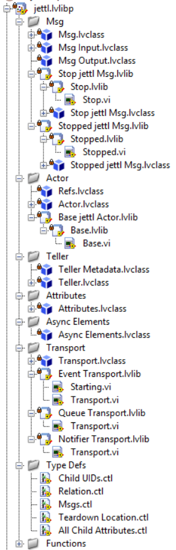
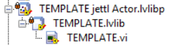
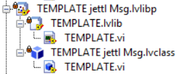

# Runtime

This document covers runtime characteristics and deployment constraints for jettl, including RT targets, scheduling considerations, PPL packaging, executables, and benchmarking.

Sections explicitly marked **Guidelines**, **Ideas**, or **Notes** are non-normative.

## Conceptual dependencies

- Ordering assumptions and messaging invariants are defined in the Core Model: see [Core Model → Scheduling and Ordering](Core%20Model.md#scheduling-and-ordering).

---

## Real-time targets (RT)

### Guidelines

For testing, decouple RT actors from hardware dependencies and RT-specific APIs. Encapsulate hardware/RT calls behind classes with well-defined interfaces. Substitute these implementations with mock objects and unit test on the desktop target.

This approach cannot validate timing behavior or hardware-specific failure modes, but it is highly effective at isolating and eliminating defects in the control logic.

> TODO: Fill in your RT validation strategy.
>
> - **Target(s):**  
> - **Timing constraints:**  
> - **Hardware failure modes to validate on-target:**  
> - **Desktop test coverage goal:**  
> - **On-target test coverage goal:**  

---

## Scheduling and priority

### Context

The baseline rule is: callers MUST assume they cannot control message execution order.

- Canonical statement: see [Core Model → Scheduling and Ordering](Core%20Model.md#scheduling-and-ordering).

### Guidelines

- Prefer designs that do not require ordering assumptions.
- If you introduce message priority, define:
  - what priority means,
  - where it is honored (which transports / queues),
  - and what it does *not* guarantee.

> TODO: Fill in jettl priority semantics (if priority exists).
>
> - **Does jettl expose message priority?**  
> - **If yes, where is it honored?**  
> - **What does priority guarantee?**  
> - **What does priority NOT guarantee?**  
> - **Acceptance tests:**  

---

## Packed project libraries (PPL)

### Overview

jettl can be released as a PPL.

### Compatibility notes

- XNodes and malleable VIs can cause build issues with PPLs; this is one reason they do not exist in jettl.

### Build guidelines

- Pick a single location for PPLs such as `C:\PPLs\[CompanyName]`.
- Name the PPL the same as the library.
- Check “Exclude dependent packed libraries”.
- Each library is its own project.

### Using the PPL version of jettl

To change a class to use the PPL version of jettl:

- Change the implemented interface to the PPL interface.
- Compose in the PPL interface.

> TODO: Fill in the exact migration steps for your repo layout.
>
> 1.  
> 2.  
> 3.  

*jettl PPL API.*

*Actor PPL API.*

*Msg PPL API.*

### PPL + executable validation checklist

> TODO: Validate PPL behavior inside an executable and record results.

| Check | Expected | Observed | Notes |
|---|---|---|---|
| Executable launches and loads PPLs |  |  |  |
| Message discovery UI still populates (for example, “msgs on the front panel”) |  |  |  |
| `Find Msgs.vi` works in the executable |  |  |  |
| No dependency-search dialogs at runtime |  |  |  |

### Further reading (PPL)

- [DebuggingSymptoms - Packed Project Library PPL Dependencies - Searching for Dependencies Dialog When Running Executable](https://forums.ni.com/t5/Community-Documents/Debugging-Symptoms-Packed-Project-Library-PPL-Dependencies-Searching-for-Dependencies-Dialog-When-Running-Executable/ta-p/4107786)
- [PPLNamespaced Dependencies - Strategy/Design Discussion - Development Issues](https://forums.ni.com/t5/LabVIEW/PPL-Namespaced-Dependencies-Strategy-Design-Discussion/td-p/4276248)
- [LUDICROUS ways to Fix Broken LabVIEW Code with Darren Nattinger | GDevConNA 2022](https://www.youtube.com/watch?v=HKcEYkksW_o)
- [GLA Summit 2022: Ludicrous Ways to Fix Broken LabVIEW Code](https://www.youtube.com/watch?v=kF_9DFPTZPc)

> TODO: Capture whether jettl Tools requires changes to fully support PPL workflows.
>
> - **Tool impacted:**  
> - **What breaks:**  
> - **Workaround:**  
> - **Planned fix:**  

---

## Executables

### Build notes

- Check Conditional Disable Structures for broken code when `RUN_TIME_ENGINE==TRUE`.
- Consider unchecking (based on your build policy):
  - Disconnect type definition
  - Remove unused polymorphic instance

### Runtime behavior notes

- `Find Msgs.vi` functions in the executable.
- In development mode, message classes are loaded into memory specific to the actor that can receive them.

> TODO: Capture the crisp explanation you want to ship publicly.
>
> - **Why “Find Msgs” works in exe (1–3 bullets):**  

### Further reading (executables)

- [GLA Summit 2022: Ludicrous Ways to Fix Broken LabVIEW Code](https://www.youtube.com/watch?v=kF_9DFPTZPc)
- [NI Forum: project mass compile - how does it work](https://forums.ni.com/t5/LabVIEW/project-mass-compile-how-does-it-work/m-p/4266014#M1242702)
- [Large LabVIEW Project Development Techniques](https://www.youtube.com/watch?v=7zS3Q_K71XY)

---

## Plugin architecture (non-normative)

### Ideas

For plugin architecture, consider a dropdown or factory pattern that selects and spawns an actor not known at edit time.

> TODO: Fill in plugin constraints and how they interact with “statically typed messaging.”
>
> - **How plugins are discovered:**  
> - **How plugin actor types are selected:**  
> - **How message contracts are validated:**  
> - **Fallback behavior if contracts are not met:**  

---

## Benchmarking

### Goals

- Measure message rate for trigger messages.
- Measure spawn-to-stopped latency for a baseline actor.

### Example benchmark sketch

- Tell `Self` 100000 messages and compute average throughput until `Stopped` is observed by the parent.
- Measure how fast a bare actor goes from spawn to when the parent observes `Stopped`.

> TODO: Fill in the benchmarking protocol so results are reproducible.
>
> | Metric | Setup | Procedure | Result | Notes |
> |---|---|---|---|---|
> | Message throughput |  |  |  |  |
> | Spawn → Stopped latency |  |  |  |  |
> | CPU usage |  |  |  |  |
> | Memory usage |  |  |  |  |

> TODO: If you have a performance target, state it explicitly.
>
> - **Throughput target(s) (per transport):**  
> - **Latency target(s):**  

---

## Feedback questions

> TODO: Answer these to tighten runtime guarantees.
>
> - **Which runtime targets must be supported (Desktop, RT, executable, PPL, PPL-in-exe)?**  
> - **Which transport is the default recommendation and why?**  
> - **What part of runtime behavior is a stable contract vs an implementation detail?**  
> - **Minimum supported LabVIEW version:**  
