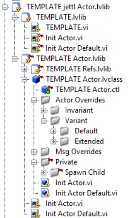

# Tooling

This document covers the developer workflow for jettl: scripting tools, packaging, debugging, testing, documentation generation, and shared readability/style conventions.

Sections explicitly marked **Guidelines**, **Ideas**, or **Notes** are non-normative.

## Tools

### Notes for all tools

- All editor tools live under: `Tools → jettl Tools`.
  - If a tool is company/name specific and credit should be preserved, place it under a subfolder, for example: `Tools → jettl Tools → YOURNAME → YOURTOOLNAME`.
- Tools can modify dependencies; only the selected project/target should be affected.
- **Requirement:** tools MUST support PPL workflows.

> TODO: Define the minimum tool quality bar.
>
> - **Supports PPL workflows:**  
> - **Supports source distribution (non-PPL):**  
> - **Does not break VI Analyzer:**  
> - **Can be run on a project subset:**  
> - **Dry-run mode (if applicable):**  
> - **Undo / rollback strategy:**  

> TODO: Tool UI improvement idea.
>
> - **Show the on-disk path in the tool tree view (right-side column):**  

### Current native tools

#### Rescript

> TODO: Document the Rescript tool.
>
> - **Menu location:**  
> - **What it does:**  
> - **Supported connector panes:**  
> - **Limitations:**  
> - **Common failure modes:**  
> - **Before/after example:**  

Current notes:

- Only the left two inputs can be scripted.
- Only the right two outputs can be scripted.

#### Rename

> TODO: Document the Rename tool.
>
> - **Scope (actor only / msg only / both):**  
> - **How uniqueness is determined:**  
> - **How collisions are resolved:**  
> - **What is not renamed:**  

Current notes:

- Renaming uses the library hierarchy to derive unique names.

#### Template

> TODO: Document the Template tool.
>
> - **What it generates:**  
> - **Where it places files:**  
> - **How it chooses names:**  
> - **How it handles existing items:**  

### Tool ideas (non-normative)

> Use this section as a roadmap input. If a tool becomes a commitment, promote it into “Current native tools” with a stable contract.

#### Moving message and actor libraries

Move actors and message libraries on disk (and in Project Explorer) into the correct destination:

- Into a `Private Msgs` folder of an actor, or
- Out of a nested library to a top-level destination.

> TODO: Decide the creation constraints.
>
> - **Can messages exist standalone (not coupled to an actor)?**  
> - **If yes, where do they live to avoid naming collisions?**  
> - **If no, what is the recommended workflow?**  

#### Forward messages

Idea: message forwarding by inspecting parent/child unified message sets.

> TODO: Tighten into a concrete design.
>
> - **Forwarding strategy (static registration vs dynamic lookup):**  
> - **How forwarding is declared (where):**  
> - **How tooling discovers forwarding:**  
> - **How failures are handled:**  

#### Generate implemented message

Workflow sketch:

1. Select actor.
2. Select interface message to implement.
3. In `Msg Overrides/`, override interface method.
4. Place the poly with recurse selected.
5. Wire recurse as needed.

> TODO: Decide how to uniquely identify a message across refactors.
>
> - **UID stored where (method description vs library description):**  
> - **Migration strategy if a message is renamed/moved:**  

#### Un-generate implemented message

Removes a message override from an actor.

> TODO: Clarify how you detect “orphaned” overrides (override exists but interface not implemented).

#### Message destination viewer

Static tool to show:

- Implemented messages
- Outbound tells to `Self`, `Parent`, `Child`, `Reply`

> TODO: Define minimum viable output.
>
> - **Per-actor report format:**  
> - **Does it require tracing through subVIs?**  

#### PPL conversion

Convert an actor and its messages to a PPL-friendly distribution.

#### Create errors in a folder

Create `placement--error.vi` style artifacts.

> TODO: Define:
>
> - **Where “placement errors” live:**  
> - **Naming convention:**  
> - **How tools discover them:**  

---

## Packaging and distribution

### VIPM

- This library is compatible with **LV 2020 and beyond**.
- If using LV2020, consider LV 2020 SP1 (bug fix rollup).

> TODO: Capture your supported LabVIEW version policy.
>
> - **Minimum supported LabVIEW version:**  
> - **Maximum tested LabVIEW version:**  
> - **How compatibility is validated:**  

### Examples packaging notes

Examples should be discoverable through the LabVIEW Example Finder and through VIPM.

> TODO: Define the release checklist for examples.
>
> - **Example Finder category:**  
> - **VIPM keywords:**  
> - **Minimum number of examples per release:**  
> - **Validation (mass compile, VI Analyzer, etc.):**  

---

## Debugging

### Debug with probes

> TODO: Decide whether you want a canonical “debug story”.
>
> - **Primary mechanism (DETT vs logging vs probes):**  
> - **When to use each mechanism:**  

### DETT debug actor (idea)

Sketch:

- In `Spawn.vi`, if `Root = True`, start another async process which gets its data by reference.
- All actors spawned afterward have a persistent core layer registered in their `Spawn.vi`.
- Only do this for the outermost actor by checking `Actor Index`.

> TODO: Confirm whether DETT data can be captured for the entire runtime set you care about (noting `vi.lib` limits).

### Base debug actor (idea)

Event logger:

- Create a file for each actor in a central temp application directory.
- Log timestamps with call chain / object hierarchy.

> TODO: Decide:
>
> - **Default on/off behavior for debug layers:**  
> - **Where logs are written:**  
> - **Log format:**  
> - **How logs are correlated across actors:**  

### Actor.vi decoration note (preserved)

- `Actor.vi` is not a decorator method; only the outermost local actor’s `Actor.vi` runs.
- An advanced scheme can wrap an “outer layer” where the wrapping layer(s) include the actor decorator method within. This allows only the DD methods outside `Actor.vi` to be executed, which can be useful for advanced debugging and testing.

> TODO: Confirm whether you want to document this as:
>
> - a supported extension point, or
> - an internal note for advanced developers only.

### Runtime message inspection

At runtime, messages can be inspected in `Call Inspect.vi` and timestamped.

> TODO: Decide whether message inspection is part of the stable contract or an optional debug layer.

---

## Unit tests

### Test frameworks

- Caraya
- LUnit
- Approval tests

### Unit testing with decoration

Because the actor model is interface-composition based (decoration), unit testing can be implemented by decorating a core actor with a unit test actor.

Preserved notes:

- Unit-test wrapper layers can log the actor object before and after message method execution (and record message inputs) to support approval-style tests and regression baselines.

> TODO: Decide which unit testing approach you want to bless.
>
> - **Blessed approach:** Decoration | harness VI | both  
> - **Minimum required tests for a new release:**  

### Actor.vi outputs for testing (preserved)

- A DD output terminal on `Actor.vi` prevents the object wire from changing at runtime.
- Output terminals are primarily for testing: when running an actor by itself, you can observe final state and error data without additional plumbing.

> TODO: Confirm whether you want to state this as a rule.
>
> - **Is `Actor.vi` allowed to omit outputs in production actors?**  
> - **If outputs exist, should callers be required to wire them?**  

### Test panel generation (idea)

Automatically generate a test panel:

- Provide controls/inputs for all messages the actor expects.
- Listen and display payloads from all message interfaces the actor exposes.

> TODO: Specify:
>
> - **Tool name / menu location:**  
> - **Payload serialization format:**  
> - **Schema versioning strategy:**  

---

## Documentation tooling

### Message documentation

Because destinations are known at edit time, tooling can visualize message flows based on `Tell Self`, `Tell Parent`, and `Tell Child`.

Potential outputs:

- Messages an actor can implement
- Messages an actor can tell to `Self`, `Parent`, and `Child`
- Actor spawning hierarchy

> TODO: Decide:
>
> - **Do you prefer static analysis, DETT-based analysis, or both?**  
> - **Which diagrams are required outputs (sequence, hierarchy, message matrix)?**  

### Tell Child destination inference

Since spawning children is dynamic, tooling needs conventions to infer the destination.

Recommended pattern:

- Use an enum wired into `Format Into String` to represent the child target.
- Avoid intermediate string manipulation or conditional destination selection when you want tooling to infer destinations.

> TODO: Decide whether this pattern is:
>
> - **Recommended:**  
> - **Required (enforced by analyzer):**  
> - **Only used for tooling but not required:**  

---

## Readability and style guide

This section is the canonical home for coding conventions referenced elsewhere.

### No helper loops

**No helper loops.**

Best practice: instead of helper loops, spin up another actor (often a private child actor).

### No property nodes

Property nodes are discouraged (for example, banner color not displayed).

### Nested libraries

Nested libraries are a namespacing and access-scope tool. Each nested library defines its own access scope controlling which parts have access to other parts.

### Composition over inheritance

Avoid class inheritance for actors. Prefer interface composition and dependency inversion.

### Connector pane conventions

Reserved connector pane terminals:

- Upper-left and upper-right terminals are reserved for the owning class/interface wire.
- Lower-left and lower-right terminals are reserved for error in/error out.

Guideline: excluding object and error terminals, keep signatures small (0–2 inputs, 0–2 outputs). If additional inputs are required, bundle them into a typedef cluster.

> TODO: Decide whether you want to enforce connector-pane rules via VI Analyzer.
>
> - **Rule enabled?**  
> - **Exceptions allowed:**  

### Serialization (pointer)

One-sentence summary: do not use error wires (or pass-through object wires) solely to serialize operations; use an explicit sequencing structure.

Canonical contract: see [Core Model → Serialization and Error Wires](Core%20Model.md#serialization-and-error-wires).

### Color scheme

Banner colors and object wire colors should match.

- Purple library: RGB (166, 153, 182)
- Blue interface: RGB (104, 136, 190)
- Green class: RGB (110, 149, 108)

Mnemonic: look down at the green grass, look up to the blue sky, and look further to the purple galaxy.

### Icon, banner, and access scope conventions

#### Access scope

- Treat access scope as a two-value system: **public** and **private**.
- Use banner/icon text color to signal access scope:
  - **Black text** = public
  - **Red text** = private

> TODO: Confirm whether you want to treat “protected” as disallowed in the codebase.
>
> - **Allowed scopes:** public/private only?  

#### Function vs method

- A **function** is a VI that does not have object IO terminals for the containing object.
- A **method** is a VI that has one or both object IO terminals for the containing class/interface.

#### Default VI templates (house style)

> TODO: Confirm the defaults you want tools to apply.
>
> - **Default function:** icon settings, connector pane, scope, reentrancy  
> - **Default SD method:** icon settings, connector pane, scope, reentrancy  
> - **Default DD method:** icon settings, connector pane, scope, reentrancy  

If you want the historical defaults captured verbatim, start here:

- **Default function**: private, error out, shared clone
- **Default SD**: private, object in + error out, shared clone
- **Default DD**: public, object in + error out, shared clone

### LabVIEW virtual folder naming

  
*Project view for an actor being developed.*

> TODO: Fill in the recommended virtual folder layout.
>
> - **Actor library virtual folders:**
>   - `Core Actors/`:
>   - `Edge Actors/`:
>   - `Base Actor/`:
>   - `Private Actors/`:
>   - `Msgs/`:
>   - `Private Msgs/`:
>   - `Unified Msgs/`:

### Mutability and pass-through conventions

- If the same object type comes in and is passed out horizontally, callers should assume it *may* have been mutated.
- Avoid pass-through outputs solely for serialization; prefer explicit sequencing structures.

Canonical contract: see [Core Model → Serialization and Error Wires](Core%20Model.md#serialization-and-error-wires).

---

## Cross-links

- Runtime constraints for PPLs/executables: see [Runtime](Runtime.md).
- Patterns and examples: see [Usage](Usage.md).
