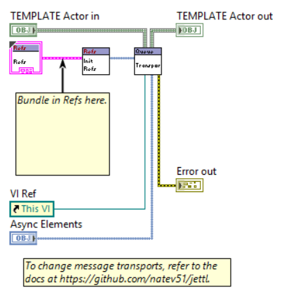
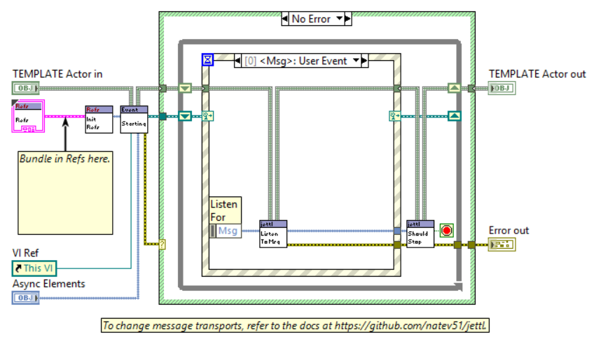
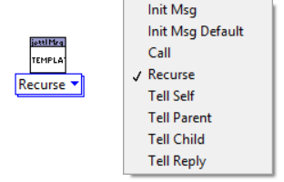
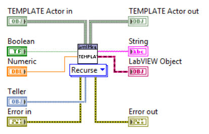

## Actor

*Queue Actor.*

*Event Actor.*

*Notifier Actor.*

---

`Finalize`: A lifecycle hook invoked at the end of each actor execution turn.

---

`No Relation`: Defined more formally as not having the same root.

---

the edge actors and core actors are persistent for every actor in the application. That means that if the root actor spawned has the `Debug jettl Actor` as one of the actors in the `Core Actors` input, this instance of the `Debug jettl Actor` will be used for each of the child actors that are spawned. The actor that is always persistent is the `Base jettl Actor`.

---

The entire jettl API has public read-only methods everywhere to gain access to the internals via a combination of method calls. These combinations of method calls can be used in wrapped actors to get necessary information of the `Unified Actor`.

---

Private Actors:
Multiple actors in one library, but there is a main actor with other libraries that contain actors, but they must be private. Rule VI analyzer can check.

---

Since jettl uses the decorator pattern, all DD methods are overridden with functionality. No override methods are available, simply move the method to the extended virtual folder (for developer experience) and append functionality as necessary.
jettl does not require ever modifying class inheritance since class inheritance is not recommended. Recommended practice is using interface implementation for all classes mixed with dependency inversion.

---

**Child UIDs**

The goal is a fully static, deterministic system that still supports dynamic behavior. In practice, that means the `Child UIDs.ctl` is static.

Under the hood, UIDs are stored as strings in `Child Attributes Map.ctl`, but the `Child UIDs.ctl` enum is the developer-facing abstraction. The enum represents the different UIDs used for child actors. Because each actor defines its own private enum, the runtime mechanism is a string mapping that can be validated to ensure it only maps enum elements to their corresponding string values.

This provides two benefits:
* Actor code uses enums exclusively, avoiding the fragility of stringly-typed identifiers.
* The internal string representation remains compatible with mapping needs.

The enum currently is edited manually. There could be a tool in the future that scripts this action.

---

`Tell Self Inspect.vi`, `Tell Parent Inspect.vi`, `Tell Child Inspect.vi` override example:
Actor messages told to actors that don't have the msg in their `Unified Msgs` determines where messages are allowed to go for a given actor (e.g., **Self**, **Parent**, **Child**) based on static selection a polymorphic message destination at edit time. Uses that knowledge to prevent invalid message paths if the relationship required by a message is not satisfied, an error will be generated at runtime preventing runtime messaging errors. Further, a static analyzer test can eliminate these runtime errors where a message is sent to an actor that cannot handle it.

This adds a defensive fallback by decorating the code in a case structure that safely handles “received but not implemented” messages by allowing an unexpected message through.

---

**Refs**

> Use of value property is generally discouraged in VIs unless you’re having to do it with a control reference inside of a SubVI -DNatt [Improving Your LabVIEW Code with the VI Analyzer](https://forums.ni.com/t5/VI-Analyzer-Enthusiasts/Improving-Your-LabVIEW-Code-with-the-VI-Analyzer/m-p/3415352)@12:26

> Tip: You may place in clusters (make sure they’re type defs) in the Refs cluster to differentiate controls, indicators, sub panels, etc.

Tend to minimize the use of references put into the Refs cluster. Instead maximize their use in the event structure for better readability.
[Your LabVIEW Code Is a Work of Art... But I Can't Read It by Darren Nattinger. GDevCon N.A. 2024](https://www.youtube.com/watch?v=AHOZ7fiuWCA)@00:45:46
Only use when these refs are used in message methods OR methods constrained in message methods. Otherwise, if there is a method call in the event structure, do you best to wire in the VI Server control reference to the method as an input instead of passing the entire object wire into the method.

---

Actor Layers
Actor layers where actors decorate each other:
- Implementing a Msg means functionality will likely be extended
- otherwise not implementing a Msg means the Msg is a no-op when it is called since it's not implemented.

This is how the `Msg or Recurse.vi` works: checks `Msgs` and determines if that actor layer has implemented that messages method or recurse to the next actor layer, reiterating until the innermost layer is called.

---

Idea for Two actor types for development

To reinforce separation of concerns, support two kinds of actors:

- Pure business logic.
- No front panel requirement.
and
- UI and event handling wrappers.
- Responsible for user interaction, message routing, and presentation concerns.  

A reusable Actor can wrap actors that do not have a front panel, providing a consistent UI/event-handling shell without coupling to the the actor layer with UI requirements.

---

Designing an actor
Start from the abstract. In architecture work, the high-level structure matters more than low-level implementation details. The objective is to define modular components and the relationships between them so they compose into a cohesive system.

A common decomposition includes **acquisition**, **analysis**, **presentation/display**, and **logging**. These concerns are often coordinated as a sequence, but they should remain **decoupled**: each has a distinct responsibility and should be able to function independently of the others. This lets you define system behavior (contracts) before committing to specific implementations.

Design **from interfaces to classes**. Begin by specifying interfaces that capture the required behavior, then implement those interfaces with concrete classes.

Prefer strong, static structure and clear boundaries. Keep components modular and independent wherever possible. Dependencies are inevitable, but they should point to **abstractions** (interfaces), which tend to change less frequently than concrete implementations.

Method access scope: The default should be that all methods are marked private (except DD methods).

Standardize rescripted methods/functions on the 4x2x2x4 connector pane pattern, consistent with connector pane guidelines.

Keep signatures small: excluding the object reference and error terminals, methods/functions should have 0–2 inputs and 0-2 outputs. If additional inputs are required, bundle them into a typedef cluster rather than expanding the connector pane.

Class private data Icons
Remove the default cube/box element from class icons.
Rely on banner and wire color conventions for identification; the cube provides minimal semantic value and is not needed to distinguish classes from interfaces.

---

Spawning an actor:
[Errors are Values; Please Treat Them That Way (Ethan Stern)](https://www.youtube.com/watch?v=8vhYLlaXaQU&list=PLvDxiIkwuMQtiOZ_WWbk6ZCXfeAKxtwo-)@17:28
Constructors (Init Actor.vi and Init Msg.vi) do not throw errors. Fundamentally, when an object is instantiated, there should not be an error that occurs.

Constructors should not throw errors. In particular any work that might fail (I/O, resource acquisition, configuration validation, etc.) should be moved into a separate method such as `Setup.vi`, where failures can be handled explicitly as part of the actor’s startup.

## Msg

These messages follow the Interface Segregation Principle (ISP) by having one method in the messages interface.

All messages come from an interface and follow ISP where one message belongs to one interface.
If there is a naming issue, that is a good thing.
It means in the dependencies, you should be packaging modules so you don't run into naming issues.

---

Messages with Type Definitions as inputs:
Type definitions as inputs SHOULD be in the library, not the class they're implemented in.
This is fundamentally an exercise in dependency inversion.
Cluster message with type def inside of the library containing the message.
Good practice to put the type def here and NOT in the class that implements the message.
This takes care of otherwise awful circular dependencies.

---

*Polymorphic Message.*

*Message implementation.*

---

Private Messages:
Putting msg library into Private Msg folder

Certain messages within an actor library are intended to be private. These messages are sent by the actor to itself and are not meant to be told by external actors.
Private messages should be clearly marked in the browser, or optionally hidden entirely, so that developers can easily distinguish between private and public messages.

Private messages that aren't exposed to external callers: Library access scope.

---

*All Messages are tied to an Interface.*
Even though as developers of the actor, we know that the message is to be returned to itself (by using Tell Self), so from the message point of view, it's still abstract in that it is being sent out to *somewhere..*, it just so happens that the message comes back to yourself.

---

`No-Children Actors` are actors that cannot spawn children. These are actors that only message with their parent and cannot have children to message with.

Since a parent must spawn a child, the parent knows the messages the child will tell it, since these are statically defined through the `Tell Parent.vi` for any particular message. Therefore, there could be a runtime check that a parent cannot spawn a child if the parent does not implement all of the messages.

Suppose an actor is intended to be used as a child actor which communicates with it's parent.

For this to work, the parent must implement the interface methods that the child uses for message communication. This requirement is communicated to other developers through the generated documentation for the child actor, which explicitly lists the messages the actor can tell to the parent and messages the child actor has implemented.

If the parent does not care about listening to any messages from the child, it is not required to implement the interface, and the message methods are effectively no-ops. This can be handled either in the parent by overriding `Call Inspect.vi`, or in the child by overriding `Tell Parent Inspect.vi`, depending on where the default behavior is most appropriate.

---

Msgs can be sent to Self and Parent (and any children spawned) in Setup.vi.

---

Unified Msgs:
Msgs are decoupled between layers telling a message defined in an internal layer but not the outer actor or core actor still means the message would be in 'Unified Msgs'.

---

Fundamentally, a message can be told to an actor that has not implemented that msg. This behavior can be modified in `Core Actors`.

---

`Unhandled Msgs`
Convincing yourself of Unhandled Msgs working
put `Panel Close?` Event with `Stop Tell Self` followed by another `Stop Tell Self`
See that the second Stop Msg was the Unhandled Msg ie 1bd with array of Msgs.

---

**Messages have the ability to output data!**
Rationale: It enables layered actors (actors that delegate to other layered actors) to use another inner layers output. For example, if an inner actor executes a method and produces analyzed data as its output, the wrapper layer can consume that output for purposes such as logging, auditing, metrics, or trace enrichment—without requiring the wrapper to re-compute or re-derive the same data or have to tell that data to a different actor.

> I would consider having a common output for all messages, such as a log interface output, on terminal 1, that can be dependency injected for the particular logging a developer would like to implement i.e. they would write their own concrete implementation.

---

jettl enforces a strongly typed messaging system where the message destination is known at edit time.

An edit-time analysis (either VI Analyzer or Actor layer) can determine which actors are allowed to spawn which other actors based on message contracts in both directions:
- What the parent can **tell to** and **listen to** its child.
- What the child can **tell to** and **listen to** its parent.

This reduces runtime errors by enforcing the contract between a launching actor and the actor it spawns. In other words, if an actor spawns another actor, the type system and analyzer checks ensure the parent abides by the child’s message interface—and the child abides by the parent’s interface—before anything runs.

Additionally, documentation tooling can leverage these static contracts to show exactly which messages flow to and from `Self`, and where they are used.

With respect to `Self`, there are five meaningful categories of messages:
- `Self → Self`
- `Parent → Self`
- `Child (with UID) → Self`
- `Self → Parent`
- `Self → Child (with UID)`
(`Self ← Self` is redundant and can be omitted.)

> **Scripting constraint:** Only the two left input terminals are valid for scripting message inputs. Other inputs are ignored during scripting.  
> If more than two inputs are required, define a typedef cluster in the message library

## Lifetime

`Stop.vi'
- always starts as `False`
- only be changed to `True` in  `Stop.vi`
- can never be changed back to `False`

`Should Stop.vi`
`Stop` = TRUE
OR
Error (then Stops)
outputs `Can Stop` = True
Error from `Finalize.vi` means that the actor should stop, hence Stop will be called, if not called already.

## Spawning

Use of inline: want to setup resources in the Main. So inline is there for the lifetime of the Main, and since references are created in main, then they are guaranteed to be alive for the application, assuming they have not been closed).

---

Bridge Actors.

---

the inline doesn't spawn an async process. This can be beneficial in case such as:
Can get outputs from the inline call i.e. Actor state and error information. This can help with dataflow to let some top level application know that the actor has stopped since the inline function has finished executing, wiring it's state/error for serialization to a user event, etc. No user event is needed to let the application know the actor has stopped, just wait for event after the actor has finished.
- You can have multiple of these in the same application.

## Errors

All errors that can occur in jettl are documented in `jettl.lvlib:Error.lvlib`

---

[The Errors of our Ways | Stephen Loftus-Mercer GDevCon N.A. 2021](https://www.youtube.com/watch?v=00TZxeyt8_A) @52:08
'That was handled, or I wouldn't have been called' - SLM

---

Errors

No error goes unrecognized.
No error goes unnoticed in the framework, everything is reported (except for releasing references).

Why are there are so many error case structures?
Unless they have an error input, all functions/methods are assumed to run unconditionally when they are called

Errors should not be used for serialization. Object serialization should also not be used. But there isn't a great way to show this in LabVIEW. Therefore, object serialization is fine, but do ensure that errors are not used for serialization.
DO NOT pass a data type from the input to the output of the method for the *sole purpose* of serialization. An indication that the data in the data type will *potentially* be manipulated is when a data type is being passed in and out through a method such as the Object IO and Error IO. This provides difficulty for readability since the developer does not know if the error is being manipulated by the method. Understand that other developers will not know your intent and will assume that the data in the datatype will be manipulated. These are the most common data types.
Unless a data type can be manipulated, then the data type should not have an output if there is an input. Not wiring the outputs gets rid of this thinking entirely for better readability.
If a method must be serialized, embrace a structure. The most common way to enforce this is with the flat sequence structure and implicitly with the case structure.

[Your LabVIEW Code Is a Work of Art... But I Can't Read It by Darren Nattinger. GDevCon N.A. 2024](https://www.youtube.com/watch?v=AHOZ7fiuWCA)@42:05
Embrace the flat sequence structure for serialization, NOT error wires.
An error wire input and output tells the developer that the error can be modified in the method!

Errors signify that
- intended operation could not be performed, otherwise said also that
- Indication that a function could not complete it’s assigned task

[The Errors of our Ways | Stephen Loftus-Mercer GDevCon N.A. 2021](https://youtu.be/00TZxeyt8_A?si=C3kbhPJ4HtcmhOfk)
[Re: Actor Stopping/Error Handling](https://forums.ni.com/t5/Actor-Framework-Discussions/Actor-Stopping-Error-Handling/m-p/3632216#M5189)

Best Practice: For EVERY method / function call, you SHOULD KNOW EVERY ERROR that will come out of that method / function, and document it for the developer. Otherwise, the error *likely* was passed from a previous method / function. You will know this by the call chain.

Best Practice: Errors should be handled with the method that generates that error. For example, when an error occurs in a method, it is best to handle the error as necessary during execution of the method call (this means in decorated methods too, think in a decorated layer of actor, handling errors that come out of `Setup.vi` in another layer).

General Error handling with Core Actors (generalized error jettl Actor):
Since each error that can occur in a method is known, `Finalize.vi`, for example, can override this behavior by clearing errors as necessary. It is the default behavior to put all jettl errors on the error wire to expose the API to the developer, and the developer can decide which errors to ignore for each individual method.
For the Errors generated in the program..
In some actor layer, can override this default behavior by overriding the ‘Finalize Turn.vi’

---

Error:
Don’t have terminals on error IO unless they are errors.
This is the same philosophy used for the object IO terminals.

---

*Minimal bend wiring philosophy = Write code for maximum readability. Notice error wire and object verticality has plenty of room between. Object wires through for IO methods. Input only methods are a couple spaces beneath. And errors follow the method calls. All wires have minimal bends. Note even this isn't great, should instead reorganize and **please** use flat sequence structure! Note that the error wire should always be pushed to the back of the block diagram. Other wires of course can move over the error wire, but wires should NOT move over the object wire.*

[Your LabVIEW Code Is a Work of Art... But I Can't Read It by Darren Nattinger. GDevCon N.A. 2024](https://www.youtube.com/watch?v=AHOZ7fiuWCA)@00:00-12:18

## Attributes

`Actors` allow Self, Parent, and Children to see their state DIRECTLY AFTER Starting, helpful for persistent actors where their common method calls 

---

## Reentrancy

Can’t use pre allocated for dynamic dispatch!!

[2016 NIWeek Casey Lamers The Right And Wrong Way To Use Settings IN LV Classes](https://youtu.be/ryrqZpIRGeY?si=bz9-C38i77r8VHw0)
@47:01

---

Reentry section:
Everything is shared clone except for:
`………`

Notable methods that deal with reentry to be talked about:
`………`

---

Actor methods should be shared clone reentrant by default