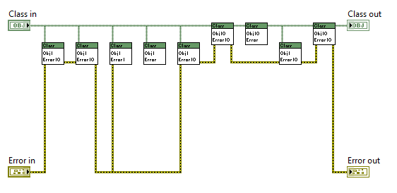

All errors that can occur in jettl are documented in `jettl.lvlib:Error.lvlib`

---

[The Errors of our Ways | Stephen Loftus-Mercer GDevCon N.A. 2021](https://www.youtube.com/watch?v=00TZxeyt8_A) @52:08
'That was handled, or I wouldn't have been called' - SLM

---

Errors

No error goes unrecognized.
No error goes unnoticed in the framework, everything is reported (except for releasing references).

Why are there are so many error case structures?
Unless they have an error input, all functions/methods are assumed to run unconditionally when they are called

Errors should not be used for serialization. Object serialization should also not be used. But there isn't a great way to show this in LabVIEW. Therefore, object serialization is fine, but do ensure that errors are not used for serialization.
DO NOT pass a data type from the input to the output of the method for the *sole purpose* of serialization. An indication that the data in the data type will *potentially* be manipulated is when a data type is being passed in and out through a method such as the Object IO and Error IO. This provides difficulty for readability since the developer does not know if the error is being manipulated by the method. Understand that other developers will not know your intent and will assume that the data in the datatype will be manipulated. These are the most common data types.
Unless a data type can be manipulated, then the data type should not have an output if there is an input. Not wiring the outputs gets rid of this thinking entirely for better readability.
If a method must be serialized, embrace a structure. The most common way to enforce this is with the flat sequence structure and implicitly with the case structure.

[Your LabVIEW Code Is a Work of Art... But I Can't Read It by Darren Nattinger. GDevCon N.A. 2024](https://www.youtube.com/watch?v=AHOZ7fiuWCA)@42:05
Embrace the flat sequence structure for serialization, NOT error wires.
An error wire input and output tells the developer that the error can be modified in the method!

Errors signify that
- intended operation could not be performed, otherwise said also that
- Indication that a function could not complete it’s assigned task

[The Errors of our Ways | Stephen Loftus-Mercer GDevCon N.A. 2021](https://youtu.be/00TZxeyt8_A?si=C3kbhPJ4HtcmhOfk)
[Re: Actor Stopping/Error Handling](https://forums.ni.com/t5/Actor-Framework-Discussions/Actor-Stopping-Error-Handling/m-p/3632216#M5189)

Best Practice: For EVERY method / function call, you SHOULD KNOW EVERY ERROR that will come out of that method / function, and document it for the developer. Otherwise, the error *likely* was passed from a previous method / function. You will know this by the call chain.

Best Practice: Errors should be handled with the method that generates that error. For example, when an error occurs in a method, it is best to handle the error as necessary during execution of the method call (this means in decorated methods too, think in a decorated layer of actor, handling errors that come out of `Setup.vi` in another layer).

General Error handling with Core Actors (generalized error jettl Actor):
Since each error that can occur in a method is known, `Finalize.vi`, for example, can override this behavior by clearing errors as necessary. It is the default behavior to put all jettl errors on the error wire to expose the API to the developer, and the developer can decide which errors to ignore for each individual method.
For the Errors generated in the program..
In some actor layer, can override this default behavior by overriding the ‘Finalize Turn.vi’

---

Error:
Don’t have terminals on error IO unless they are errors.
This is the same philosophy used for the object IO terminals.

---

*Minimal bend wiring philosophy = Write code for maximum readability. Notice error wire and object verticality has plenty of room between. Object wires through for IO methods. Input only methods are a couple spaces beneath. And errors follow the method calls. All wires have minimal bends. Note even this isn't great, should instead reorganize and **please** use flat sequence structure! Note that the error wire should always be pushed to the back of the block diagram. Other wires of course can move over the error wire, but wires should NOT move over the object wire.*

[Your LabVIEW Code Is a Work of Art... But I Can't Read It by Darren Nattinger. GDevCon N.A. 2024](https://www.youtube.com/watch?v=AHOZ7fiuWCA)@00:00-12:18