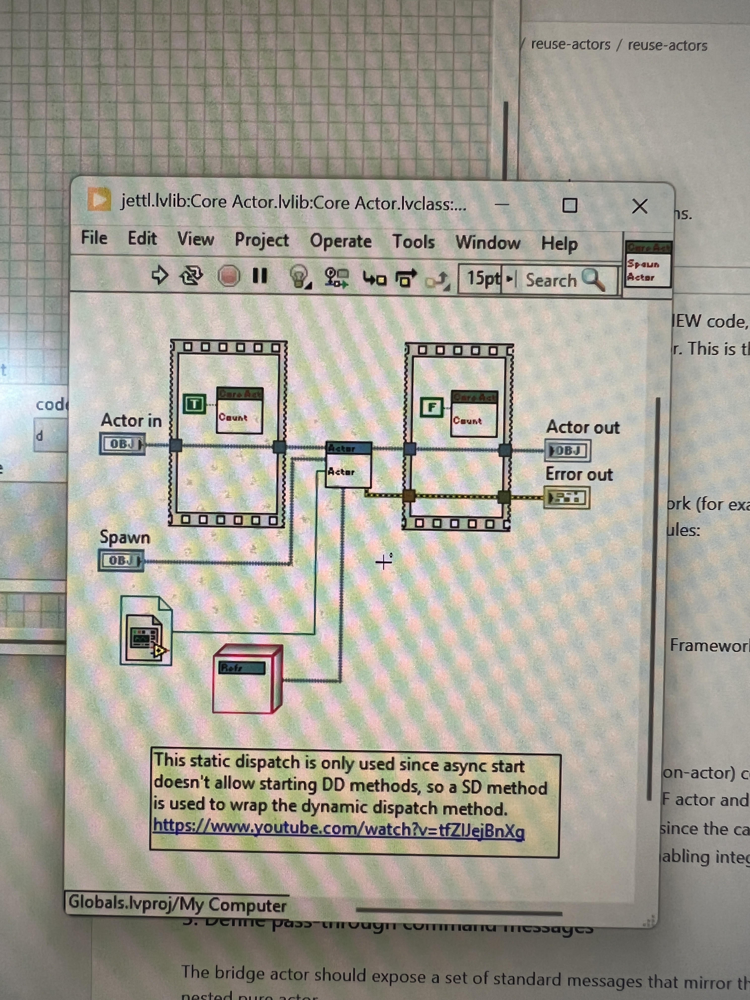

*The following includes a list of changes to the framework that can be done immediately.*
*The order of items presented is in no particular order.*

---

Rename tool
change the scripting to rename the TEMPLATE Refs at it's object front panel names AND containing library.
**Name Ref**

---

rename the init methods with init Xxxxxx where the xxxxxxx the interface name

---

Descriptions for message naming:
Use .ini parsing to get the unique identifier associated with message in the description.
i.e.
$
[Msg]
"UID": e3b0c44298fc1c149afbf4c8996fb92427ae41e4649b934ca495991b7852b855
$

---

Find Local Msg Set can occur in spawning. Since can iterate on every decoration, outputs the local msg set array that is found and appends to an array which appends to another array of all decorations, which goes into the Union Local Msg Set function.
This ensemble can go into its own function too, this function puts out “Unified Msg Set”

Now, there might be some renaming for these clusters again..

---

Spawn Actor.vi
delete Actor.vi function, just use the Actor.vi DD?
Add in comment that also, there are the count and initializing the actor constants.

---

Check that UID is not blank
create a function that can be dropped around for this.

---