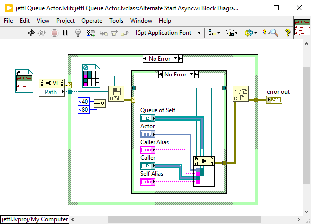

Use of inline: want to setup resources in the Main. So inline is there for the lifetime of the Main, and since references are created in main, then they are guaranteed to be alive for the application, assuming they have not been closed).

---

Bridge Actors.

