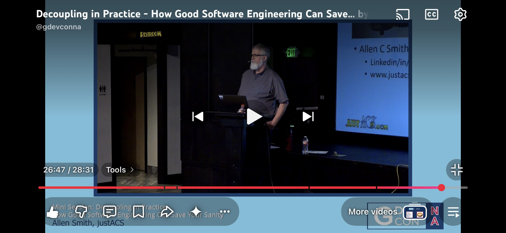

**NO Helper Loops!**
Best practice: Instead of helper loops, spin up another actor.

Private Actor virtual folder allows actors to live within another actors library.
Separating the concerns of actors should be a normality where there’s the controller and view.
Think for an actor system, a queue actor that needs an event helper loop. Rather, make this helper loop an event actor that is tightly coupled to the queue actor by having the event actor in the same library as the queue actor.

---

**No Property Nodes!**

Property Nodes are not used due to banner color not being displayed.

[Using a Message Broker with DQMH Actors for High Speed/Throughput Data logging](https://www.youtube.com/watch?v=jNBAvNQJyO8&list=PLvDxiIkwuMQvrSQIqy_it5Q7-sGvM4XX8&index=3)
@7:33

---

Nested Libraries Reason:
Comment from Greg:
